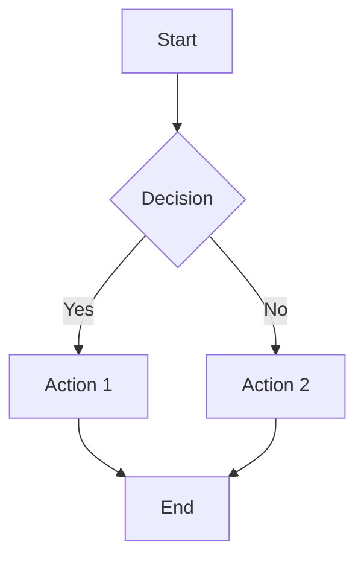
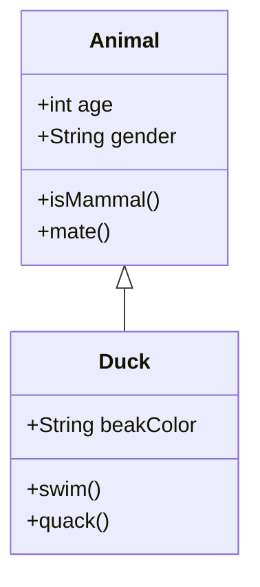
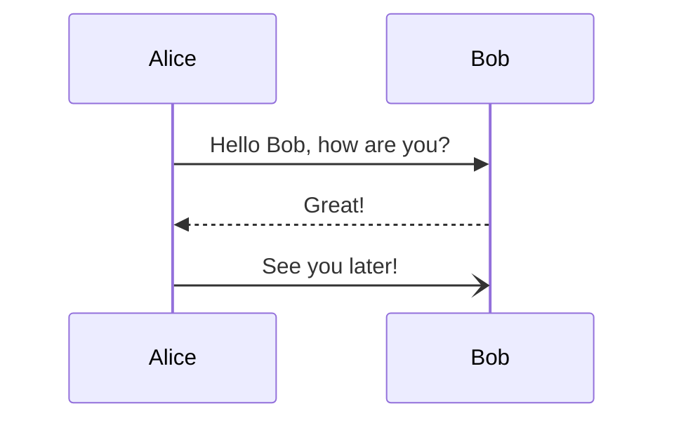

# DD Preview Parser

A modern, full-stack diagram editor built with Next.js that allows users to create, edit, and export beautiful diagrams with real-time preview. Supports Mermaid diagrams, flowcharts, class diagrams, and more.

## ✨ Features

### 🎨 Diagram Creation & Editing
- **Real-time Preview**: See your diagrams render instantly as you type
- **Monaco Editor**: Professional code editor with syntax highlighting
- **Multiple Diagram Types**: Support for Mermaid, flowcharts, class diagrams, sequence diagrams
- **Responsive Design**: Works seamlessly on desktop and mobile devices
- **Modern UI**: Clean, intuitive interface with gradient backgrounds and modern styling

### 🔐 Authentication & User Management
- **NextAuth.js Integration**: Secure authentication with JWT tokens
- **User Registration & Login**: Complete auth flow with form validation
- **Dashboard**: Personal dashboard for managing saved diagrams
- **Account Settings**: User profile and account management
- **Protected Routes**: Secure access to user-specific content

### 💾 Diagram Management
- **Save & Load**: Save diagrams to your personal collection
- **Export Functionality**: Export diagrams in multiple formats
- **Public/Private**: Control visibility of your diagrams
- **Export History**: Track your export activities
- **Search & Filter**: Find diagrams quickly

### 🛠️ Technical Features
- **TypeScript**: Full type safety throughout the application
- **Tailwind CSS**: Modern, responsive styling
- **MongoDB Integration**: Scalable data storage
- **API Routes**: RESTful API for all operations
- **Performance Optimized**: Debounced rendering and optimized callbacks

## 🚀 Quick Start

### Prerequisites
- Node.js 18+ 
- npm or yarn
- MongoDB (local or cloud)

### Installation

1. **Clone the repository**
   ```bash
   git clone https://github.com/durdan/dd-preview-parser.git
   cd dd-preview-parser
   ```

2. **Install dependencies**
   ```bash
   npm install
   ```

3. **Set up environment variables**
   ```bash
   cp .env.example .env.local
   ```
   
   Edit `.env.local` with your configuration:
   ```env
   MONGODB_URI=mongodb://localhost:27017/dd-preview-parser
   NEXTAUTH_SECRET=your-secret-key-here
   NEXTAUTH_URL=http://localhost:3000
   ```

4. **Start the development server**
   ```bash
   npm run dev
   ```

5. **Open your browser**
   Navigate to [http://localhost:3000](http://localhost:3000)

## 📁 Project Structure

```
dd-preview-parser/
├── app/                          # Next.js App Router
│   ├── api/                      # API routes
│   │   └── auth/                 # Authentication endpoints
│   ├── auth/                     # Auth pages (login, register)
│   ├── globals.css               # Global styles
│   ├── layout.tsx                # Root layout
│   ├── page.tsx                  # Landing page
│   └── providers.tsx             # Context providers
├── src/
│   ├── components/               # React components
│   │   ├── DiagramEditor.tsx     # Main diagram editor
│   │   ├── DiagramPreview.tsx    # Diagram preview
│   │   ├── Dashboard.jsx         # User dashboard
│   │   └── ...
│   ├── services/                 # Business logic
│   │   ├── DiagramService.js     # Diagram CRUD operations
│   │   ├── DiagramRenderer.ts    # Diagram rendering
│   │   └── ...
│   ├── hooks/                    # Custom React hooks
│   ├── types/                    # TypeScript type definitions
│   └── utils/                    # Utility functions
├── lib/                          # Library configurations
│   ├── auth.ts                   # NextAuth configuration
│   └── mongodb.ts                # Database connection
└── tests/                        # Test files
```

## 🎯 Usage

### Creating Diagrams

1. **Start Creating**: The editor opens with a sample Mermaid flowchart
2. **Edit Content**: Use the Monaco editor to write your diagram code
3. **Real-time Preview**: See your diagram render in the preview panel
4. **Save Diagram**: Click save to store in your personal collection

### Supported Diagram Types

#### Mermaid Flowcharts


#### Class Diagrams


#### Sequence Diagrams


### Authentication

1. **Register**: Create a new account at `/auth/register`
2. **Login**: Sign in at `/auth/login`
3. **Dashboard**: Access your personal dashboard at `/dashboard`
4. **Account Settings**: Manage your profile and preferences

## 🛠️ Development

### Available Scripts

```bash
# Development
npm run dev          # Start development server
npm run build        # Build for production
npm run start        # Start production server
npm run lint         # Run ESLint

# Testing
npm run test         # Run tests
npm run test:watch   # Run tests in watch mode
```

### API Endpoints

#### Authentication
- `POST /api/auth/register` - User registration
- `POST /api/auth/[...nextauth]` - NextAuth endpoints

#### Diagrams (Planned)
- `GET /api/diagrams` - Get user diagrams
- `POST /api/diagrams` - Create new diagram
- `GET /api/diagrams/[id]` - Get specific diagram
- `PUT /api/diagrams/[id]` - Update diagram
- `DELETE /api/diagrams/[id]` - Delete diagram

## 🏗️ Architecture

### Technology Stack
- **Frontend**: Next.js 14, React 18, TypeScript
- **Styling**: Tailwind CSS
- **Authentication**: NextAuth.js
- **Database**: MongoDB with Mongoose
- **Editor**: Monaco Editor
- **Diagrams**: Mermaid.js
- **State Management**: React Hooks
- **API**: Next.js API Routes

### Key Design Decisions
- **Full-Stack Next.js**: Single codebase for frontend and backend
- **TypeScript**: Type safety and better developer experience
- **Component-Based**: Modular, reusable React components
- **API-First**: RESTful API design for scalability
- **Mobile-First**: Responsive design with mobile optimization

## 🔧 Configuration

### Environment Variables

| Variable | Description | Default |
|----------|-------------|---------|
| `MONGODB_URI` | MongoDB connection string | `mongodb://localhost:27017/dd-preview-parser` |
| `NEXTAUTH_SECRET` | NextAuth secret key | `development-secret-key` |
| `NEXTAUTH_URL` | Application URL | `http://localhost:3000` |

### MongoDB Setup

1. **Local MongoDB**
   ```bash
   # Install MongoDB
   brew install mongodb-community
   
   # Start MongoDB
   brew services start mongodb-community
   ```

2. **MongoDB Atlas** (Cloud)
   - Create account at [MongoDB Atlas](https://www.mongodb.com/atlas)
   - Create cluster and get connection string
   - Update `MONGODB_URI` in `.env.local`

## 🧪 Testing

```bash
# Run all tests
npm test

# Run tests in watch mode
npm run test:watch

# Run specific test file
npm test DiagramEditor.test.tsx
```

## 📦 Deployment

### Vercel (Recommended)

1. **Connect Repository**
   ```bash
   # Install Vercel CLI
   npm i -g vercel
   
   # Deploy
   vercel
   ```

2. **Environment Variables**
   Set the following in Vercel dashboard:
   - `MONGODB_URI`
   - `NEXTAUTH_SECRET`
   - `NEXTAUTH_URL`

### Docker

```bash
# Build image
docker build -t dd-preview-parser .

# Run container
docker run -p 3000:3000 dd-preview-parser
```

## 🤝 Contributing

1. Fork the repository
2. Create a feature branch: `git checkout -b feature/amazing-feature`
3. Commit changes: `git commit -m 'Add amazing feature'`
4. Push to branch: `git push origin feature/amazing-feature`
5. Open a Pull Request

### Development Guidelines
- Use TypeScript for all new code
- Follow React best practices
- Write tests for new features
- Update documentation as needed
- Use conventional commit messages

## 📄 License

This project is licensed under the MIT License - see the [LICENSE](LICENSE) file for details.

## 🙏 Acknowledgments

- [Next.js](https://nextjs.org/) - React framework
- [Mermaid](https://mermaid-js.github.io/) - Diagram generation
- [Monaco Editor](https://microsoft.github.io/monaco-editor/) - Code editor
- [Tailwind CSS](https://tailwindcss.com/) - Styling framework
- [NextAuth.js](https://next-auth.js.org/) - Authentication

## 📞 Support

- **Issues**: [GitHub Issues](https://github.com/durdan/dd-preview-parser/issues)
- **Discussions**: [GitHub Discussions](https://github.com/durdan/dd-preview-parser/discussions)
- **Email**: [Contact Support](mailto:support@dd-preview-parser.com)

---

**Made with ❤️ by the DD Preview Parser team**
