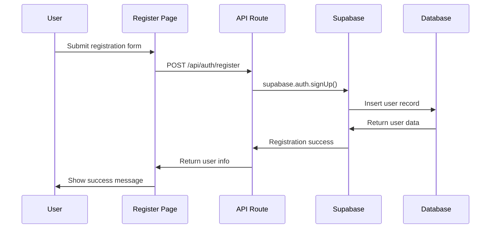
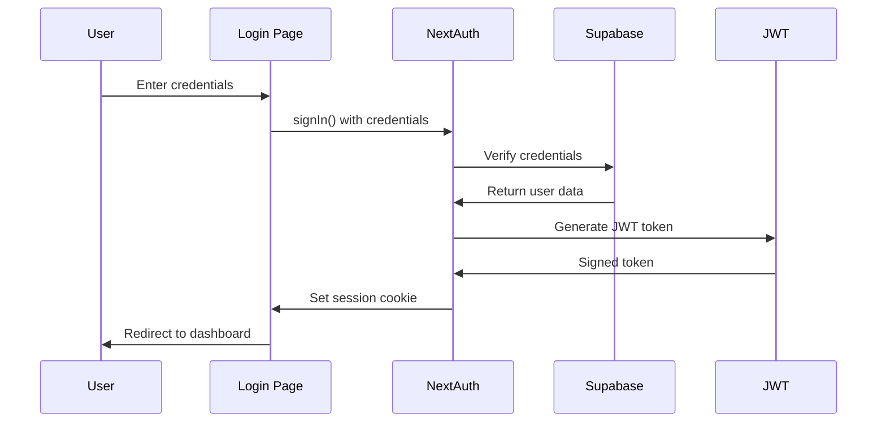

# Authentication Architecture

## Overview

DD Preview Parser implements a **JWT-based authentication system** using NextAuth.js, providing secure user sessions, OAuth integration capabilities, and seamless integration with the Supabase backend. The system supports both credential-based and social authentication flows.

## NextAuth.js Configuration

### Core Setup

```typescript
// Authentication configuration [ref: lib/auth.ts]
import NextAuth from 'next-auth';
import CredentialsProvider from 'next-auth/providers/credentials';
import { createClient } from '@supabase/supabase-js';

const supabase = createClient(
  process.env.NEXT_PUBLIC_SUPABASE_URL!,
  process.env.SUPABASE_SERVICE_ROLE_KEY!
);

export const authOptions = {
  providers: [
    CredentialsProvider({
      name: 'credentials',
      credentials: {
        email: { label: 'Email', type: 'email' },
        password: { label: 'Password', type: 'password' }
      },
      async authorize(credentials) {
        if (!credentials?.email || !credentials?.password) {
          return null;
        }

        // Verify credentials against Supabase
        const { data, error } = await supabase.auth.signInWithPassword({
          email: credentials.email,
          password: credentials.password,
        });

        if (error || !data.user) {
          return null;
        }

        return {
          id: data.user.id,
          email: data.user.email,
          name: data.user.user_metadata?.name || data.user.email,
        };
      },
    }),
  ],
  session: {
    strategy: 'jwt',
    maxAge: 30 * 24 * 60 * 60, // 30 days
  },
  callbacks: {
    async jwt({ token, user }) {
      if (user) {
        token.id = user.id;
      }
      return token;
    },
    async session({ session, token }) {
      if (token) {
        session.user.id = token.id as string;
      }
      return session;
    },
  },
  pages: {
    signIn: '/auth/login',
    signUp: '/auth/register',
  },
};

export default NextAuth(authOptions);
```

### API Route Handler

```typescript
// NextAuth API route [ref: app/api/auth/[...nextauth]/route.ts]
import NextAuth from 'next-auth';
import { authOptions } from '@/lib/auth';

const handler = NextAuth(authOptions);

export { handler as GET, handler as POST };
```

## Authentication Flow

### 1. User Registration



**Implementation**:
```typescript
// Registration page [ref: app/auth/register/page.tsx]
'use client';

import { useState } from 'react';
import { createClientComponentClient } from '@supabase/auth-helpers-nextjs';
import { useRouter } from 'next/navigation';

export default function RegisterPage() {
  const [email, setEmail] = useState('');
  const [password, setPassword] = useState('');
  const [name, setName] = useState('');
  const [loading, setLoading] = useState(false);
  const router = useRouter();
  const supabase = createClientComponentClient();

  const handleRegister = async (e: React.FormEvent) => {
    e.preventDefault();
    setLoading(true);

    try {
      const { error } = await supabase.auth.signUp({
        email,
        password,
        options: {
          data: {
            name,
          },
        },
      });

      if (error) throw error;

      router.push('/auth/login?message=Check your email to confirm your account');
    } catch (error) {
      console.error('Registration error:', error);
    } finally {
      setLoading(false);
    }
  };

  return (
    <form onSubmit={handleRegister} className="space-y-4">
      <input
        type="text"
        placeholder="Full Name"
        value={name}
        onChange={(e) => setName(e.target.value)}
        required
      />
      <input
        type="email"
        placeholder="Email"
        value={email}
        onChange={(e) => setEmail(e.target.value)}
        required
      />
      <input
        type="password"
        placeholder="Password"
        value={password}
        onChange={(e) => setPassword(e.target.value)}
        required
      />
      <button type="submit" disabled={loading}>
        {loading ? 'Creating Account...' : 'Sign Up'}
      </button>
    </form>
  );
}
```

### 2. User Login



**Implementation**:
```typescript
// Login page [ref: app/auth/login/page.tsx]
'use client';

import { useState } from 'react';
import { signIn, getSession } from 'next-auth/react';
import { useRouter } from 'next/navigation';

export default function LoginPage() {
  const [email, setEmail] = useState('');
  const [password, setPassword] = useState('');
  const [loading, setLoading] = useState(false);
  const [error, setError] = useState('');
  const router = useRouter();

  const handleLogin = async (e: React.FormEvent) => {
    e.preventDefault();
    setLoading(true);
    setError('');

    try {
      const result = await signIn('credentials', {
        email,
        password,
        redirect: false,
      });

      if (result?.error) {
        setError('Invalid credentials');
        return;
      }

      if (result?.ok) {
        const session = await getSession();
        if (session) {
          router.push('/dashboard');
        }
      }
    } catch (error) {
      setError('An error occurred during login');
    } finally {
      setLoading(false);
    }
  };

  return (
    <form onSubmit={handleLogin} className="space-y-4">
      <input
        type="email"
        placeholder="Email"
        value={email}
        onChange={(e) => setEmail(e.target.value)}
        required
      />
      <input
        type="password"
        placeholder="Password"
        value={password}
        onChange={(e) => setPassword(e.target.value)}
        required
      />
      {error && <div className="text-red-500">{error}</div>}
      <button type="submit" disabled={loading}>
        {loading ? 'Signing In...' : 'Sign In'}
      </button>
    </form>
  );
}
```

## Session Management

### 1. Server-Side Session Validation

```typescript
// Session validation in API routes [ref: app/api/diagrams/route.ts]
import { getServerSession } from 'next-auth/next';
import { authOptions } from '@/lib/auth';

export async function GET(request: NextRequest) {
  // Validate session on server side
  const session = await getServerSession(authOptions);
  
  if (!session?.user?.id) {
    return NextResponse.json(
      { error: 'Authentication required' }, 
      { status: 401 }
    );
  }

  // Session is valid, proceed with request
  const userId = session.user.id;
  // ... rest of API logic
}
```

### 2. Client-Side Session Handling

```typescript
// Session provider setup [ref: app/layout.tsx]
'use client';

import { SessionProvider } from 'next-auth/react';

export default function RootLayout({
  children,
}: {
  children: React.ReactNode;
}) {
  return (
    <html lang="en">
      <body>
        <SessionProvider>
          {children}
        </SessionProvider>
      </body>
    </html>
  );
}
```

```typescript
// Using session in components [ref: app/dashboard/page.tsx]
'use client';

import { useSession } from 'next-auth/react';
import { useRouter } from 'next/navigation';
import { useEffect } from 'react';

export default function DashboardPage() {
  const { data: session, status } = useSession();
  const router = useRouter();

  useEffect(() => {
    if (status === 'loading') return; // Still loading
    
    if (!session) {
      router.push('/auth/login');
      return;
    }
  }, [session, status, router]);

  if (status === 'loading') {
    return <div>Loading...</div>;
  }

  if (!session) {
    return null; // Will redirect
  }

  return (
    <div>
      <h1>Welcome, {session.user?.name || session.user?.email}</h1>
      {/* Dashboard content */}
    </div>
  );
}
```

## Route Protection

### 1. Middleware-Based Protection

```typescript
// Middleware for route protection [ref: middleware.ts]
import { withAuth } from 'next-auth/middleware';

export default withAuth(
  function middleware(req) {
    // Additional middleware logic can go here
    console.log('Authenticated request to:', req.url);
  },
  {
    callbacks: {
      authorized: ({ token, req }) => {
        // Check if user has access to the requested route
        const { pathname } = req.nextUrl;
        
        // Protect dashboard and editor routes
        if (pathname.startsWith('/dashboard') || pathname.startsWith('/editor')) {
          return !!token;
        }
        
        // Public routes
        return true;
      },
    },
  }
);

export const config = {
  matcher: ['/dashboard/:path*', '/editor/:path*', '/api/diagrams/:path*'],
};
```

### 2. Component-Level Protection

```typescript
// Protected component wrapper [ref: src/components/ProtectedRoute.tsx]
'use client';

import { useSession } from 'next-auth/react';
import { useRouter } from 'next/navigation';
import { useEffect } from 'react';

interface ProtectedRouteProps {
  children: React.ReactNode;
  redirectTo?: string;
}

export default function ProtectedRoute({ 
  children, 
  redirectTo = '/auth/login' 
}: ProtectedRouteProps) {
  const { data: session, status } = useSession();
  const router = useRouter();

  useEffect(() => {
    if (status === 'loading') return;
    
    if (!session) {
      router.push(redirectTo);
    }
  }, [session, status, router, redirectTo]);

  if (status === 'loading') {
    return (
      <div className="flex items-center justify-center min-h-screen">
        <div>Loading...</div>
      </div>
    );
  }

  if (!session) {
    return null;
  }

  return <>{children}</>;
}
```

## Integration with Supabase

### 1. Row Level Security (RLS) Integration

```sql
-- RLS policies that work with NextAuth sessions [ref: supabase-schema.sql]
-- Enable RLS on diagrams table
ALTER TABLE diagrams ENABLE ROW LEVEL SECURITY;

-- Policy for authenticated users to view their own diagrams
CREATE POLICY "Users can view own diagrams" ON diagrams
  FOR SELECT USING (
    auth.uid()::text = owner_id OR is_public = true
  );

-- Policy for authenticated users to insert diagrams
CREATE POLICY "Users can insert own diagrams" ON diagrams
  FOR INSERT WITH CHECK (
    auth.uid()::text = owner_id
  );

-- Policy for users to update their own diagrams
CREATE POLICY "Users can update own diagrams" ON diagrams
  FOR UPDATE USING (
    auth.uid()::text = owner_id
  );

-- Policy for users to delete their own diagrams
CREATE POLICY "Users can delete own diagrams" ON diagrams
  FOR DELETE USING (
    auth.uid()::text = owner_id
  );
```

### 2. Supabase Client with NextAuth Integration

```typescript
// Supabase client with NextAuth session [ref: lib/supabase.ts]
import { createClient } from '@supabase/supabase-js';
import { getServerSession } from 'next-auth/next';
import { authOptions } from './auth';

const supabaseUrl = process.env.NEXT_PUBLIC_SUPABASE_URL!;
const supabaseKey = process.env.NEXT_PUBLIC_SUPABASE_ANON_KEY!;

export const supabase = createClient(supabaseUrl, supabaseKey);

// Helper function to get authenticated Supabase client
export async function getAuthenticatedSupabaseClient() {
  const session = await getServerSession(authOptions);
  
  if (!session?.user?.id) {
    throw new Error('User not authenticated');
  }

  // Set auth token for RLS
  const { data, error } = await supabase.auth.signInWithPassword({
    email: session.user.email!,
    password: '', // This would need to be handled differently in production
  });

  if (error) {
    throw new Error('Failed to authenticate with Supabase');
  }

  return supabase;
}
```

## Security Considerations

### 1. JWT Token Security

```typescript
// JWT configuration for security [ref: lib/auth.ts]
export const authOptions = {
  // ... other config
  jwt: {
    maxAge: 60 * 60 * 24 * 30, // 30 days
    // Use secure JWT secret in production
    secret: process.env.NEXTAUTH_SECRET,
  },
  session: {
    strategy: 'jwt',
    maxAge: 30 * 24 * 60 * 60, // 30 days
    updateAge: 24 * 60 * 60, // 24 hours
  },
  cookies: {
    sessionToken: {
      name: 'next-auth.session-token',
      options: {
        httpOnly: true,
        sameSite: 'lax',
        path: '/',
        secure: process.env.NODE_ENV === 'production',
      },
    },
  },
};
```

### 2. CSRF Protection

```typescript
// CSRF protection in API routes [ref: app/api/diagrams/route.ts]
import { headers } from 'next/headers';

export async function POST(request: NextRequest) {
  // Verify CSRF token
  const headersList = headers();
  const origin = headersList.get('origin');
  const host = headersList.get('host');
  
  if (origin !== `https://${host}`) {
    return NextResponse.json(
      { error: 'CSRF token mismatch' }, 
      { status: 403 }
    );
  }

  // ... rest of API logic
}
```

### 3. Rate Limiting

```typescript
// Rate limiting for authentication endpoints
import { Ratelimit } from '@upstash/ratelimit';
import { Redis } from '@upstash/redis';

const ratelimit = new Ratelimit({
  redis: Redis.fromEnv(),
  limiter: Ratelimit.slidingWindow(10, '1 m'), // 10 requests per minute
});

export async function POST(request: NextRequest) {
  const ip = request.ip ?? '127.0.0.1';
  const { success } = await ratelimit.limit(ip);
  
  if (!success) {
    return NextResponse.json(
      { error: 'Too many requests' }, 
      { status: 429 }
    );
  }

  // ... authentication logic
}
```

## Error Handling

### 1. Authentication Errors

```typescript
// Centralized auth error handling [ref: lib/auth-errors.ts]
export class AuthenticationError extends Error {
  constructor(message: string, public code: string) {
    super(message);
    this.name = 'AuthenticationError';
  }
}

export function handleAuthError(error: any) {
  if (error.message?.includes('Invalid login credentials')) {
    return {
      error: 'Invalid email or password',
      code: 'INVALID_CREDENTIALS'
    };
  }
  
  if (error.message?.includes('Email not confirmed')) {
    return {
      error: 'Please check your email and confirm your account',
      code: 'EMAIL_NOT_CONFIRMED'
    };
  }
  
  return {
    error: 'An error occurred during authentication',
    code: 'UNKNOWN_ERROR'
  };
}
```

### 2. Session Expiry Handling

```typescript
// Session refresh and expiry handling [ref: src/hooks/useAuth.ts]
import { useSession, signOut } from 'next-auth/react';
import { useRouter } from 'next/navigation';

export function useAuth() {
  const { data: session, status } = useSession();
  const router = useRouter();

  const handleSessionExpiry = async () => {
    await signOut({ redirect: false });
    router.push('/auth/login?message=Session expired, please login again');
  };

  const isAuthenticated = status === 'authenticated' && session;
  const isLoading = status === 'loading';

  return {
    session,
    isAuthenticated,
    isLoading,
    handleSessionExpiry,
  };
}
```

## OAuth Integration (Future Enhancement)

### 1. Google OAuth Setup

```typescript
// Google OAuth provider configuration
import GoogleProvider from 'next-auth/providers/google';

export const authOptions = {
  providers: [
    GoogleProvider({
      clientId: process.env.GOOGLE_CLIENT_ID!,
      clientSecret: process.env.GOOGLE_CLIENT_SECRET!,
    }),
    // ... other providers
  ],
  callbacks: {
    async signIn({ user, account, profile }) {
      if (account?.provider === 'google') {
        // Custom logic for Google OAuth users
        const { data, error } = await supabase.auth.signInWithOAuth({
          provider: 'google',
          options: {
            queryParams: {
              access_type: 'offline',
              prompt: 'consent',
            },
          },
        });
        
        return !error;
      }
      
      return true;
    },
  },
};
```

---

**Related Documentation**:
- [System Overview](./system-overview.md) - High-level architecture
- [Data Flow](./data-flow.md) - Request lifecycle patterns
- [Storage Architecture](./storage-architecture.md) - Database and RLS integration

**Navigation**: [← Back to Data Flow](./data-flow.md) | [Next: Storage Architecture →](./storage-architecture.md)