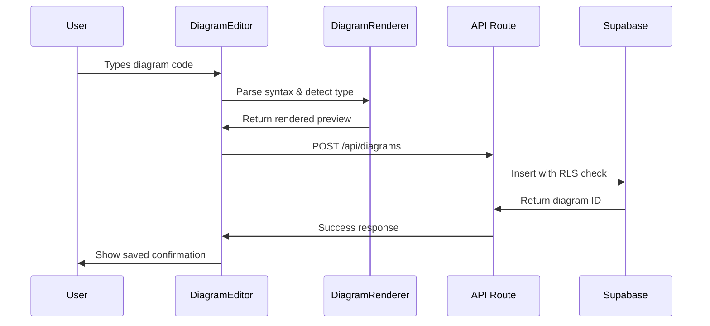
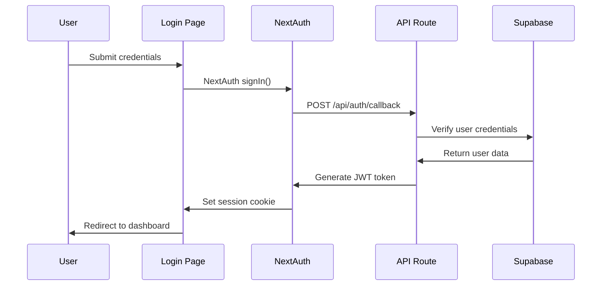
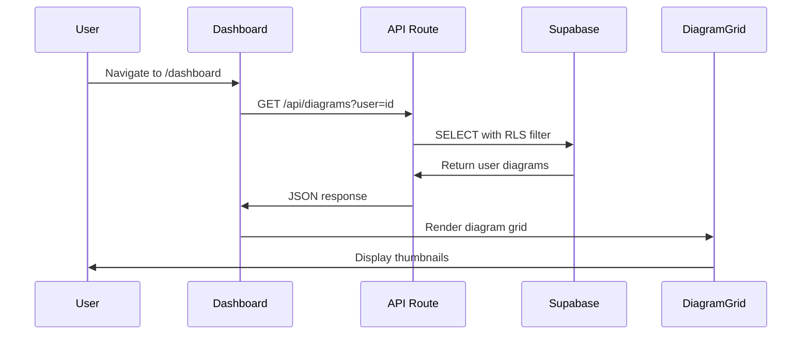

# Data Flow Architecture

## Request Lifecycle Overview

The DD Preview Parser follows a **client-server-database** data flow pattern with real-time updates and external service integration. This document traces the complete journey of data through the system.

## Core Data Flow Patterns

### 1. Diagram Creation Flow



**Implementation References**:
- **Editor Component**: [src/components/DiagramEditor.tsx:45-67](../../../src/components/DiagramEditor.tsx)
- **Render Service**: [src/services/DiagramRenderer.ts:12-35](../../../src/services/DiagramRenderer.ts)
- **API Handler**: [app/api/diagrams/route.ts:15-28](../../../app/api/diagrams/route.ts)

### 2. Authentication Flow



**Implementation References**:
- **Login Page**: [app/auth/login/page.tsx:22-40](../../../app/auth/login/page.tsx)
- **Auth Config**: [lib/auth.ts:8-25](../../../lib/auth.ts)
- **API Handler**: [app/api/auth/[...nextauth]/route.ts](../../../app/api/auth/[...nextauth]/route.ts)

### 3. Dashboard Loading Flow



**Implementation References**:
- **Dashboard Page**: [app/dashboard/page.tsx:15-32](../../../app/dashboard/page.tsx)
- **Grid Component**: [app/dashboard/components/DiagramGrid.tsx](../../../app/dashboard/components/DiagramGrid.tsx)
- **API Route**: [app/api/diagrams/route.ts:8-14](../../../app/api/diagrams/route.ts)

## Real-Time Rendering Pipeline

### Mermaid Diagram Rendering

```javascript
// DiagramRenderer.ts implementation
async function renderMermaidDiagram(content: string): Promise<string> {
  try {
    // 1. Import Mermaid dynamically for performance
    const mermaid = await import('mermaid');
    
    // 2. Configure Mermaid settings
    mermaid.initialize({ 
      theme: 'default',
      securityLevel: 'strict' 
    });
    
    // 3. Generate unique ID for SVG element
    const id = `mermaid-${Date.now()}`;
    
    // 4. Render diagram to SVG
    const { svg } = await mermaid.render(id, content);
    
    return svg;
  } catch (error) {
    throw new DiagramRenderError(`Mermaid rendering failed: ${error.message}`);
  }
}
```

**Reference**: [src/services/DiagramRenderer.ts:45-68](../../../src/services/DiagramRenderer.ts)

### PlantUML Server Integration

```javascript
// PlantUML server communication flow
async function renderPlantUMLDiagram(content: string): Promise<string> {
  // 1. Encode diagram content
  const encoded = encodePlantUML(content);
  
  // 2. Send to PlantUML server
  const response = await fetch(`${PLANTUML_SERVER}/svg/${encoded}`);
  
  // 3. Handle server response
  if (!response.ok) {
    throw new PlantUMLError(`Server responded with ${response.status}`);
  }
  
  return await response.text();
}
```

**Reference**: [src/services/plantuml-server.js:42-58](../../../src/services/plantuml-server.js)

## API Route Patterns

### 1. CRUD Operations

All API routes follow RESTful conventions with consistent error handling:

```typescript
// Standard API route structure [ref: app/api/diagrams/route.ts]
export async function GET(request: NextRequest) {
  try {
    // 1. Extract session and validate authentication
    const session = await getServerSession(authOptions);
    if (!session?.user?.id) {
      return NextResponse.json({ error: 'Unauthorized' }, { status: 401 });
    }

    // 2. Parse query parameters
    const { searchParams } = new URL(request.url);
    const page = parseInt(searchParams.get('page') || '1');
    
    // 3. Query database with RLS
    const { data, error } = await supabase
      .from('diagrams')
      .select('*')
      .eq('owner_id', session.user.id)
      .range((page - 1) * 20, page * 20);

    // 4. Handle database errors
    if (error) {
      return NextResponse.json({ error: 'Database error' }, { status: 500 });
    }

    // 5. Return structured response
    return NextResponse.json({ diagrams: data, page });
  } catch (error) {
    return NextResponse.json(
      { error: 'Internal server error' }, 
      { status: 500 }
    );
  }
}
```

### 2. Error Handling Strategy

**Client-Side Error Boundaries**:
```typescript
// Error boundary for diagram rendering [ref: src/components/DiagramPreview.tsx]
function DiagramPreview({ content, type }: DiagramPreviewProps) {
  const [error, setError] = useState<string | null>(null);
  const [loading, setLoading] = useState(false);

  useEffect(() => {
    async function renderDiagram() {
      setLoading(true);
      setError(null);
      
      try {
        const result = await DiagramRenderer.render(content, type);
        setRenderedDiagram(result);
      } catch (err) {
        setError(err.message);
      } finally {
        setLoading(false);
      }
    }

    renderDiagram();
  }, [content, type]);

  if (error) return <ErrorDisplay message={error} />;
  if (loading) return <LoadingSpinner />;
  
  return <div dangerouslySetInnerHTML={{ __html: renderedDiagram }} />;
}
```

## Database Interaction Patterns

### 1. Row Level Security (RLS) Implementation

```sql
-- RLS policies ensure users only access their own data
-- [ref: supabase-schema.sql:25-35]
CREATE POLICY "Users can view own diagrams" ON diagrams
  FOR SELECT USING (auth.uid() = owner_id);

CREATE POLICY "Users can insert own diagrams" ON diagrams
  FOR INSERT WITH CHECK (auth.uid() = owner_id);

CREATE POLICY "Users can update own diagrams" ON diagrams
  FOR UPDATE USING (auth.uid() = owner_id);

CREATE POLICY "Anyone can view public diagrams" ON diagrams
  FOR SELECT USING (is_public = true);
```

### 2. TypeScript Database Client

```typescript
// Typed Supabase client [ref: lib/supabase.ts]
import { createClient } from '@supabase/supabase-js';
import type { Database } from '@/types/supabase';

const supabase = createClient<Database>(
  process.env.NEXT_PUBLIC_SUPABASE_URL!,
  process.env.NEXT_PUBLIC_SUPABASE_ANON_KEY!
);

// Type-safe database operations
async function getDiagrams(userId: string): Promise<Diagram[]> {
  const { data, error } = await supabase
    .from('diagrams')
    .select(`
      id,
      title,
      content,
      type,
      is_public,
      created_at,
      updated_at
    `)
    .eq('owner_id', userId)
    .order('updated_at', { ascending: false });

  if (error) throw new DatabaseError(error.message);
  return data;
}
```

## State Management Patterns

### 1. Client-Side State Flow

```typescript
// DiagramEditor state management [ref: src/components/DiagramEditor.tsx]
function DiagramEditor() {
  // Local state for immediate UI updates
  const [content, setContent] = useState('');
  const [isDirty, setIsDirty] = useState(false);
  const [lastSaved, setLastSaved] = useState<Date | null>(null);

  // Persistent state via localStorage
  const [drafts, setDrafts] = useLocalStorage('diagram-drafts', {});

  // Server state synchronization
  const [diagram, setDiagram] = useState<Diagram | null>(null);
  
  // Handle content changes with debouncing
  const debouncedSave = useMemo(
    () => debounce(async (newContent: string) => {
      if (diagram?.id) {
        await saveDiagram(diagram.id, newContent);
        setLastSaved(new Date());
        setIsDirty(false);
      }
    }, 1000),
    [diagram?.id]
  );

  const handleContentChange = (newContent: string) => {
    setContent(newContent);
    setIsDirty(true);
    debouncedSave(newContent);
  };
}
```

### 2. Server State Management

API routes maintain stateless operation with session-based authentication:

```typescript
// Session validation pattern used across API routes
async function validateSession(request: NextRequest) {
  const session = await getServerSession(authOptions);
  
  if (!session?.user?.id) {
    throw new AuthenticationError('User not authenticated');
  }
  
  return session.user;
}

// Database transaction patterns
async function updateDiagramWithHistory(diagramId: string, updates: Partial<Diagram>) {
  const { data, error } = await supabase.rpc('update_diagram_with_history', {
    diagram_id: diagramId,
    updates: updates,
    user_id: session.user.id
  });
  
  if (error) throw new DatabaseError(error.message);
  return data;
}
```

## External Service Integration

### 1. PlantUML Server Communication

```javascript
// PlantUML service integration [ref: src/services/plantuml-server.js]
class PlantUMLService {
  constructor(serverUrl = 'https://www.plantuml.com/plantuml') {
    this.serverUrl = serverUrl;
  }

  async validateSyntax(diagram) {
    const encoded = this.encodeDiagram(diagram);
    const response = await fetch(`${this.serverUrl}/check/${encoded}`);
    return response.ok;
  }

  async renderDiagram(diagram, format = 'svg') {
    const encoded = this.encodeDiagram(diagram);
    const response = await fetch(`${this.serverUrl}/${format}/${encoded}`);
    
    if (!response.ok) {
      throw new Error(`PlantUML server error: ${response.status}`);
    }
    
    return await response.text();
  }

  encodeDiagram(diagram) {
    // PlantUML encoding algorithm implementation
    return plantumlEncoder.encode(diagram);
  }
}
```

### 2. Supabase Real-time Integration

```typescript
// Real-time diagram updates [ref: dashboard/components/DiagramGrid.tsx]
useEffect(() => {
  const channel = supabase
    .channel('diagram-changes')
    .on(
      'postgres_changes',
      { 
        event: '*', 
        schema: 'public', 
        table: 'diagrams',
        filter: `owner_id=eq.${session.user.id}`
      },
      (payload) => {
        console.log('Diagram changed:', payload);
        // Update local state based on database changes
        handleDiagramUpdate(payload);
      }
    )
    .subscribe();

  return () => {
    supabase.removeChannel(channel);
  };
}, [session.user.id]);
```

## Performance Optimization Patterns

### 1. Client-Side Caching

```typescript
// Service worker caching strategy [ref: mentioned in architecture]
const CACHE_NAME = 'dd-preview-parser-v1';
const STATIC_RESOURCES = [
  '/favicon.ico',
  '/manifest.json',
  // Monaco Editor assets cached separately
];

self.addEventListener('fetch', (event) => {
  if (event.request.url.includes('/api/')) {
    // API responses - cache with network-first strategy
    event.respondWith(networkFirst(event.request));
  } else {
    // Static assets - cache-first strategy
    event.respondWith(cacheFirst(event.request));
  }
});
```

### 2. Database Query Optimization

```sql
-- Indexes for common query patterns [ref: supabase-schema.sql]
CREATE INDEX idx_diagrams_owner_updated ON diagrams(owner_id, updated_at DESC);
CREATE INDEX idx_diagrams_public ON diagrams(is_public) WHERE is_public = true;
CREATE INDEX idx_diagrams_type ON diagrams(type);

-- Materialized view for dashboard statistics
CREATE MATERIALIZED VIEW user_diagram_stats AS
SELECT 
  owner_id,
  COUNT(*) as total_diagrams,
  COUNT(*) FILTER (WHERE is_public = true) as public_diagrams,
  MAX(updated_at) as last_activity
FROM diagrams
GROUP BY owner_id;
```

## Error Recovery Patterns

### 1. Graceful Degradation

```typescript
// Fallback rendering when external services fail
async function renderDiagramWithFallback(content: string, type: DiagramType) {
  try {
    if (type === 'mermaid') {
      return await renderMermaidDiagram(content);
    } else {
      return await renderPlantUMLDiagram(content);
    }
  } catch (error) {
    console.warn(`${type} rendering failed, using text fallback:`, error);
    
    // Fallback to syntax-highlighted code block
    return `<pre><code class="language-${type}">${escapeHtml(content)}</code></pre>`;
  }
}
```

### 2. Retry Logic for External Services

```typescript
// Exponential backoff for PlantUML server
async function renderWithRetry(content: string, maxRetries = 3) {
  for (let attempt = 1; attempt <= maxRetries; attempt++) {
    try {
      return await renderPlantUMLDiagram(content);
    } catch (error) {
      if (attempt === maxRetries) throw error;
      
      const delay = Math.min(1000 * Math.pow(2, attempt - 1), 10000);
      await new Promise(resolve => setTimeout(resolve, delay));
    }
  }
}
```

---

**Related Documentation**:
- [System Overview](./system-overview.md) - High-level architecture
- [Authentication](./authentication.md) - NextAuth.js implementation
- [Storage Architecture](./storage-architecture.md) - Database design and RLS

**Navigation**: [← Back to System Overview](./system-overview.md) | [Next: Authentication →](./authentication.md)