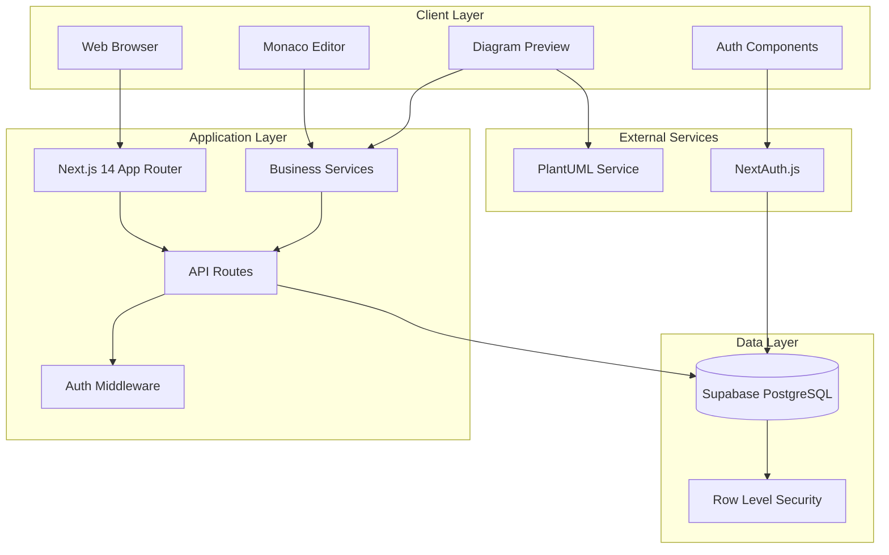
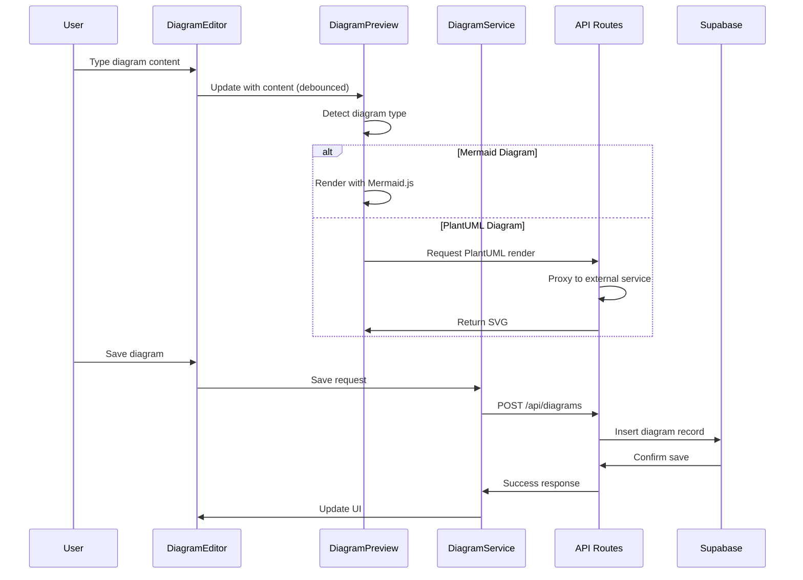
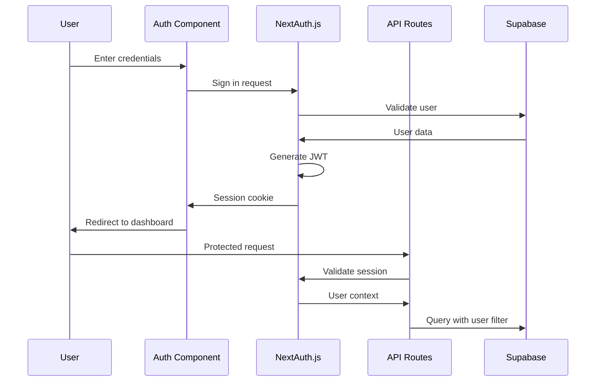
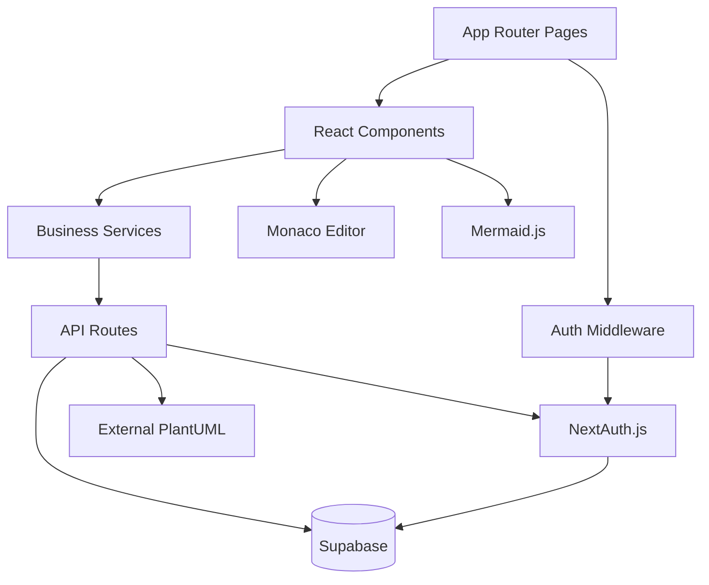

# Architecture Overview

This document provides a comprehensive view of the diagram editor application's architecture, built as a Next.js 14 full-stack web application.

## Table of Contents

1. [System Architecture](#system-architecture)
2. [Technology Stack](#technology-stack)
3. [Application Layers](#application-layers)
4. [Data Flow](#data-flow)
5. [Module Dependencies](#module-dependencies)
6. [Performance Considerations](#performance-considerations)

## System Architecture



## Technology Stack

### Core Framework
- **Next.js 14** with App Router [ref: package.json, next.config.js]
  - Server-side rendering and static generation
  - API routes for backend functionality
  - Automatic code splitting and optimization

### Frontend Technologies
- **React 18** with TypeScript [ref: src/components/]
  - Component-based architecture
  - Type safety across the application
  - Modern React patterns (hooks, context)

- **Monaco Editor** [ref: src/components/DiagramEditor.tsx]
  - VS Code-based code editor
  - Syntax highlighting for Mermaid and PlantUML
  - Auto-completion and error detection

- **Tailwind CSS** [ref: package.json]
  - Utility-first CSS framework
  - Responsive design system
  - Consistent styling across components

### Backend Services
- **NextAuth.js** [ref: lib/auth.ts]
  - Authentication and session management
  - JWT-based tokens
  - Credentials provider for email/password

- **Supabase** [ref: supabase-schema.sql]
  - PostgreSQL database with real-time capabilities
  - Row Level Security (RLS) for data protection
  - Built-in authentication integration

### Diagram Rendering
- **Mermaid.js** [ref: src/components/DiagramPreview.tsx]
  - Client-side diagram rendering
  - Supports flowcharts, sequence diagrams, class diagrams
  - Real-time preview updates

- **PlantUML Service** [ref: app/api/plantuml/render/route.ts]
  - External service integration
  - Server-side rendering for PlantUML diagrams
  - SVG output format

## Application Layers

### 1. Presentation Layer
**Location**: `/app/`, `/components/`, `/src/components/`

**Responsibilities**:
- User interface components
- Page routing and navigation
- Client-side state management
- User input handling

**Key Components**:
- `DiagramEditor` [ref: src/components/DiagramEditor.tsx] - Main editing interface
- `DiagramPreview` [ref: src/components/DiagramPreview.tsx] - Real-time preview renderer
- `AuthComponents` [ref: components/] - Login/register forms
- `Dashboard` [ref: app/] - User diagram management

### 2. Business Logic Layer
**Location**: `/src/services/`

**Responsibilities**:
- Diagram type detection and parsing
- Business rule enforcement
- Data transformation and validation
- External service integration

**Key Services**:
- `DiagramService` [ref: src/services/diagramService.ts] - API communication
- `DiagramParser` [ref: src/services/diagramParser.ts] - Content analysis
- `DiagramRenderer` [ref: src/services/diagramRenderer.ts] - Rendering coordination

### 3. API Layer
**Location**: `/app/api/`

**Responsibilities**:
- HTTP request handling
- Authentication middleware
- Data validation and sanitization
- Database operations

**Key Routes**:
- `/api/diagrams` [ref: app/api/diagrams/route.ts] - CRUD operations
- `/api/auth` [ref: app/api/auth/] - Authentication endpoints
- `/api/plantuml` [ref: app/api/plantuml/render/route.ts] - External service proxy

### 4. Data Layer
**Location**: Supabase PostgreSQL

**Responsibilities**:
- Persistent data storage
- User authentication
- Access control and security
- Data integrity and consistency

**Schema**: [ref: supabase-schema.sql]
```sql
-- Users table (managed by Supabase Auth)
-- Diagrams table with user ownership
-- Row Level Security policies
```

## Data Flow

### Diagram Creation Flow


### Authentication Flow


## Module Dependencies

### Core Dependencies


### File-Level Dependencies
- **DiagramEditor** depends on Monaco Editor, DiagramService
- **DiagramPreview** depends on Mermaid.js, DiagramRenderer
- **API Routes** depend on NextAuth, Supabase client
- **Authentication** depends on NextAuth configuration [ref: lib/auth.ts]

## Performance Considerations

### Client-Side Optimizations
- **Code Splitting**: Next.js automatic splitting by route [ref: next.config.js]
- **Dynamic Imports**: Monaco Editor loaded only when needed [ref: app/page.tsx]
- **Debounced Updates**: 300ms delay for live preview [ref: src/components/DiagramPreview.tsx]
- **Canvas Externals**: Heavy graphics libraries externalized [ref: next.config.js]

### Server-Side Optimizations
- **API Response Caching**: Diagram renders cached for repeated requests
- **Database Indexes**: Optimized queries with user-based filtering [ref: supabase-schema.sql]
- **Row Level Security**: Database-level access control reduces application overhead

### Build Optimizations
```javascript
// next.config.js webpack configuration
module.exports = {
  webpack: (config) => {
    config.externals = {
      canvas: 'commonjs canvas',
      'utf-8-validate': 'commonjs utf-8-validate',
      bufferutil: 'commonjs bufferutil'
    };
    return config;
  }
}
```

## Security Architecture

### Authentication Security
- **JWT Tokens**: Stateless authentication with secure tokens
- **Session Management**: Server-side session validation
- **Password Hashing**: Supabase handles secure password storage

### Data Security
- **Row Level Security**: Database-level access control [ref: supabase-schema.sql]
- **Input Validation**: Multi-layer validation in API and client [ref: lib/validation.js]
- **CORS Configuration**: Controlled cross-origin resource sharing

### API Security
- **Middleware Protection**: Authentication middleware on protected routes
- **Rate Limiting**: Built-in Next.js rate limiting capabilities
- **Input Sanitization**: XSS and injection prevention

---

## Related Pages
- [Diagram Processing](../diagram-processing.md) - Detailed rendering pipeline
- [API Reference](../api-reference.md) - Complete API documentation
- [Authentication System](../authentication-system.md) - Auth implementation details
- [Data Models](../data-models.md) - Database schema and entities

*All file references are relative to repository root: `/workspace/main-repo/`*