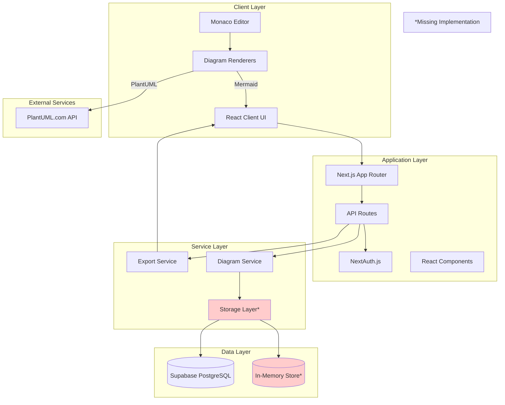
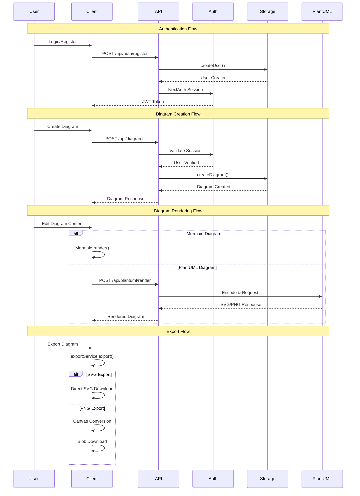
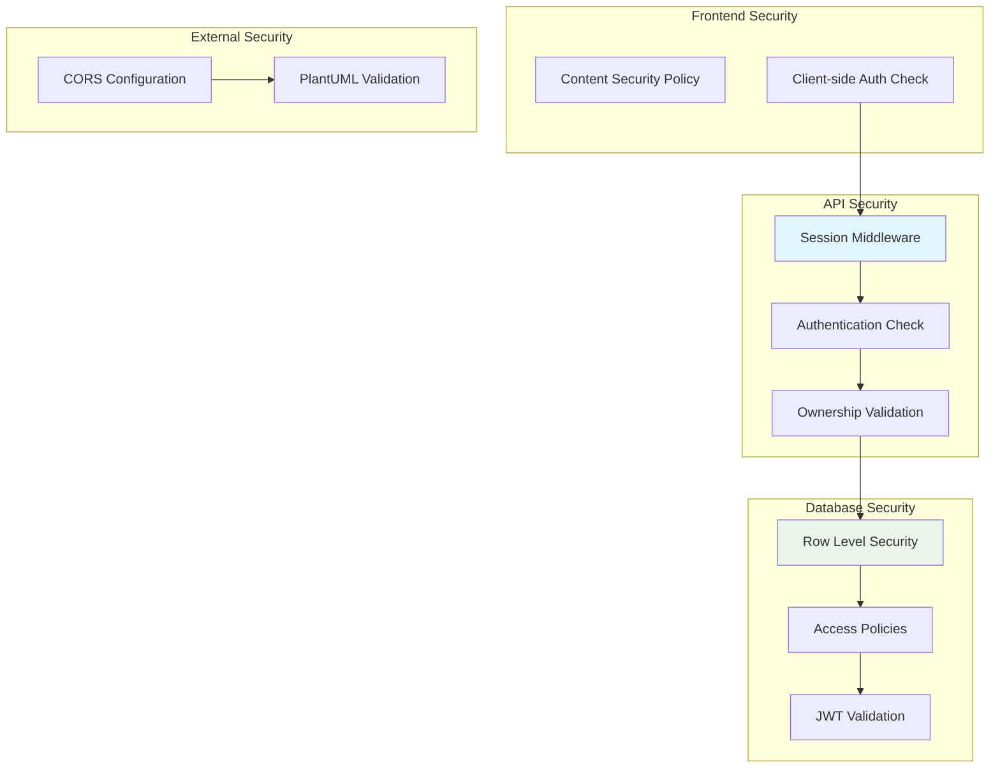

# System Architecture

## Overview

This document provides detailed architecture diagrams for the DD Preview Parser diagram editor application.

## High-Level System Architecture



**Reference Files:**
- Frontend: `app/page.tsx`, `app/layout.tsx`
- API Layer: `app/api/` directory
- Services: `services/diagramService.ts`, `services/exportService.js`
- Storage: `@/lib/storage` (missing), `supabase-schema.sql`

## Component Architecture

```mermaid
graph TD
    subgraph "App Router Structure"
        Layout[layout.tsx]
        Providers[providers.tsx]
        HomePage[page.tsx]

        subgraph "Authentication"
            AuthPage[auth/page.tsx]
            AuthForm[AuthForm.tsx]
            AuthAPI[api/auth/]
        end

        subgraph "Dashboard"
            DashboardPage[dashboard/page.tsx]
            DiagramList[DiagramList Component]
        end

        subgraph "Editor"
            EditorPage[editor/[id]/page.tsx]
            MonacoEditor[Monaco Editor]
            DiagramPreview[Diagram Preview]
            ExportPanel[ExportPanel.js]
            SharePanel[SharePanel.tsx]
        end
    end

    subgraph "Shared Components"
        UIComponents[components/ui/]
        SharedView[SharedDiagramView.tsx]
    end

    subgraph "Business Logic"
        DiagramHook[useDiagrams.ts]
        DiagramService[diagramService.ts]
        ExportService[exportService.js]
    end

    Layout --> HomePage
    Layout --> AuthPage
    Layout --> DashboardPage
    Layout --> EditorPage

    AuthPage --> AuthForm
    AuthForm --> AuthAPI

    DashboardPage --> DiagramList
    DiagramList --> DiagramHook

    EditorPage --> MonacoEditor
    EditorPage --> DiagramPreview
    EditorPage --> ExportPanel
    EditorPage --> SharePanel

    DiagramHook --> DiagramService
    ExportPanel --> ExportService
    SharePanel --> SharedView

    DiagramService --> |Missing| Storage[lib/storage]

    style Storage fill:#ffcccc
```

**Reference Files:**
- Pages: `app/` directory structure
- Components: `components/` directory
- Hooks: `hooks/useDiagrams.ts`
- Services: `services/` directory

## Data Flow Architecture



**Reference Files:**
- Authentication: `lib/auth.ts`, `app/api/auth/`
- Diagram API: `app/api/diagrams/`
- PlantUML: `app/api/plantuml/`
- Export: `services/exportService.js`

## Security Architecture



**Security Features:**
- **Authentication**: NextAuth.js with JWT tokens (30-day expiry)
- **Password Security**: bcryptjs hashing with salt rounds of 12
- **API Protection**: Session validation on all protected routes
- **Database Security**: Supabase RLS policies for user data isolation
- **Input Validation**: PlantUML content validation before external API calls

**Reference Files:**
- Auth Config: `lib/auth.ts`
- API Security: `app/api/diagrams/route.ts:8-23`
- Database Security: `supabase-schema.sql:35-59`
- Validation: `lib/validation.js`

---

## Architecture Notes

### Current Implementation Status
- ✅ **Frontend Architecture**: Complete with Next.js 14 and React 18
- ✅ **Authentication System**: NextAuth.js fully configured
- ✅ **External Integrations**: PlantUML API integration working
- ⚠️ **Storage Layer**: Missing `@/lib/storage` implementation
- ⚠️ **Database Integration**: Supabase schema ready but not connected

### Critical Dependencies
- **Monaco Editor**: Dynamic loading to prevent SSR issues
- **Mermaid**: Client-side diagram rendering
- **PlantUML External**: Dependency on plantuml.com service
- **NextAuth**: Session management and JWT handling

### Performance Considerations
- **Client-side Export**: Reduces server load for diagram exports
- **Dynamic Loading**: Monaco Editor loaded only when needed
- **External API**: PlantUML rendering adds network latency
- **Memory Storage**: Current in-memory approach doesn't persist data

---

*[← Back to Wiki Index](../index.md) | [System Overview](../system-overview.md)*