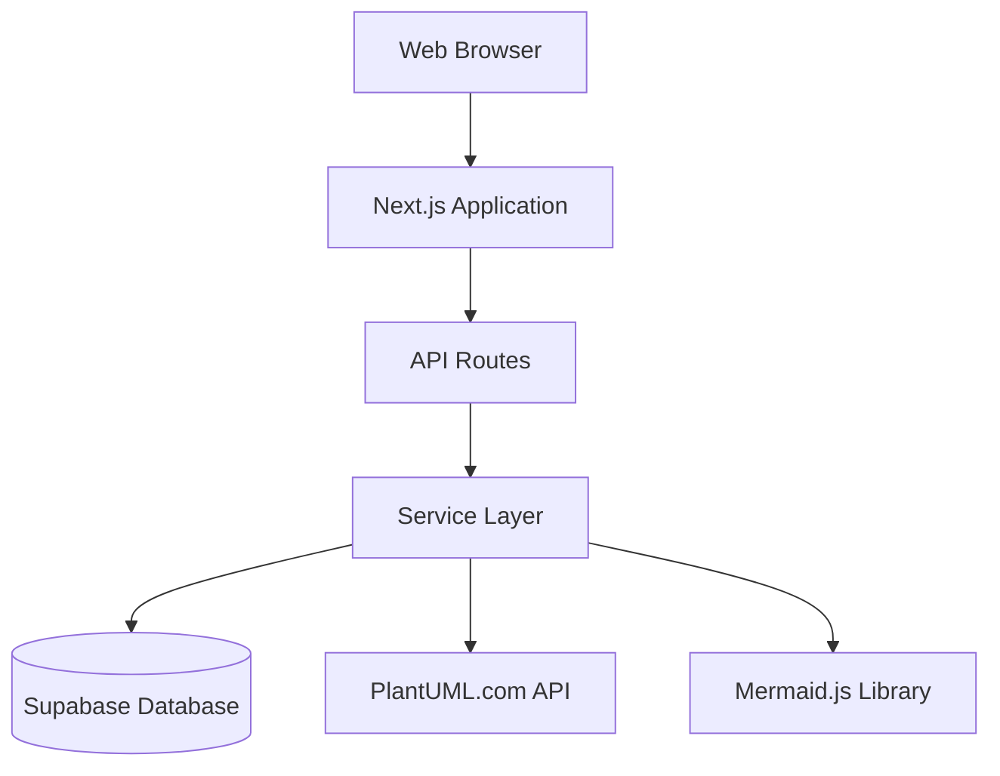
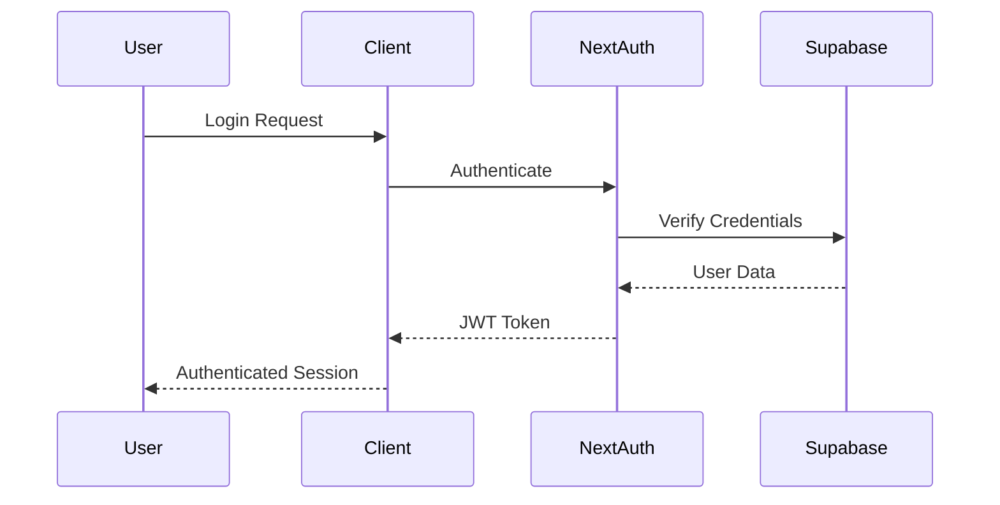
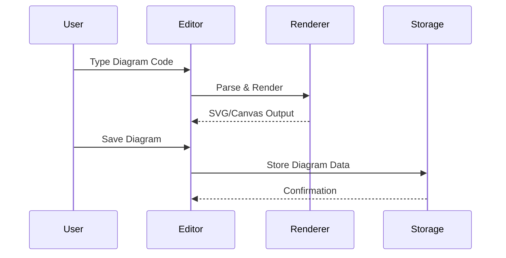

# System Design

This document outlines the high-level architecture of the DD Preview Parser application, a diagram creation and editing platform built with Next.js.

## Architecture Overview

### System Components

The application follows a modern web architecture with the following layers:

1. **Frontend Layer** - Next.js App Router with React components
2. **API Layer** - RESTful endpoints for business operations
3. **Service Layer** - Business logic and external integrations
4. **Data Layer** - Supabase PostgreSQL with Row Level Security



### Technology Stack

#### Frontend Technologies
- **Next.js 14** - React framework with App Router [ref: package.json, app/layout.tsx]
- **React 18** - Component library with modern hooks [ref: src/components/]
- **TypeScript** - Type-safe development [ref: tsconfig.json, src/types/]
- **Monaco Editor** - VS Code editor engine [ref: src/components/DiagramEditor.tsx]
- **Tailwind CSS** - Utility-first styling [ref: tailwind.config.js]

#### Backend Technologies
- **Next.js API Routes** - Server-side endpoints [ref: app/api/]
- **NextAuth.js** - Authentication framework [ref: lib/auth.ts]
- **Supabase** - PostgreSQL database and auth backend [ref: supabase-schema.sql]

#### Diagram Technologies
- **Mermaid.js** - Client-side diagram rendering [ref: src/services/DiagramRenderer.ts]
- **PlantUML** - Server-side diagram rendering via external API [ref: app/api/plantuml/]

## Data Flow Architecture

### User Authentication Flow



**Implementation Details:**
- Authentication handled by NextAuth.js [ref: lib/auth.ts]
- User data stored in Supabase users table [ref: supabase-schema.sql:1-8]
- JWT tokens for session management
- Protected routes via middleware [ref: middleware.ts]

### Diagram Creation Flow



**Implementation Details:**
- Monaco Editor for code input [ref: src/components/DiagramEditor.tsx:45-78]
- Debounced rendering for performance [ref: src/hooks/useDebouncedValue.ts]
- Mermaid.js for client-side rendering [ref: src/services/DiagramRenderer.ts:22-45]
- Diagram storage via API [ref: app/api/diagrams/route.ts]

## Core Modules

### 1. Editor Module (`/src/components/`)

**Primary Components:**
- `DiagramEditor.tsx` - Main editor container with Monaco integration
- `DiagramPreview.tsx` - Live preview component with Mermaid rendering
- `ExportPanel.js` - Export functionality UI

**Key Features:**
- Real-time syntax highlighting
- Live preview updates
- Multiple diagram format support
- Export to various formats (SVG, PNG, PDF)

### 2. API Module (`/app/api/`)

**Core Endpoints:**
- `/api/diagrams` - CRUD operations for diagram management [ref: app/api/diagrams/route.ts]
- `/api/auth` - NextAuth.js authentication endpoints [ref: app/api/auth/]
- `/api/plantuml` - PlantUML rendering proxy [ref: app/api/plantuml/]

**Request/Response Patterns:**
```typescript
// Diagram API Contract [ref: app/api/diagrams/route.ts:15-25]
interface DiagramRequest {
  title: string;
  description?: string;
  content: string;
  type: 'mermaid' | 'plantuml';
  isPublic: boolean;
}

interface DiagramResponse {
  id: string;
  ...DiagramRequest;
  ownerId: string;
  createdAt: string;
  updatedAt: string;
}
```

### 3. Service Layer (`/services/`, `/src/services/`)

**Core Services:**
- `DiagramRenderer.ts` - Mermaid.js integration and rendering logic [ref: src/services/DiagramRenderer.ts]
- `diagramService.ts` - Business logic for diagram operations [ref: services/diagramService.ts]
- `exportService.js` - Export functionality and format conversion [ref: services/exportService.js]

**Service Responsibilities:**
- External API integrations
- Business rule enforcement
- Data transformation
- Error handling and logging

### 4. Data Layer

**Database Schema** [ref: supabase-schema.sql]:
```sql
-- Users table with UUID primary keys
CREATE TABLE users (
  id UUID PRIMARY KEY DEFAULT gen_random_uuid(),
  email VARCHAR(255) UNIQUE NOT NULL,
  name VARCHAR(255),
  created_at TIMESTAMP DEFAULT NOW()
);

-- Diagrams table with foreign key relationships
CREATE TABLE diagrams (
  id UUID PRIMARY KEY DEFAULT gen_random_uuid(),
  title VARCHAR(255) NOT NULL,
  description TEXT,
  content TEXT NOT NULL,
  type VARCHAR(50) NOT NULL,
  is_public BOOLEAN DEFAULT false,
  owner_id UUID REFERENCES users(id),
  created_at TIMESTAMP DEFAULT NOW(),
  updated_at TIMESTAMP DEFAULT NOW()
);
```

**Row Level Security (RLS):**
- Users can only access their own diagrams
- Public diagrams readable by all users
- Insert/update/delete restricted to owners

## Performance Considerations

### Client-Side Optimizations
- **Dynamic Imports** - Heavy libraries loaded on-demand [ref: app/page.tsx:6-14]
- **Debounced Rendering** - Optimized diagram updates to prevent excessive re-renders [ref: src/hooks/useDebouncedValue.ts]
- **Component Lazy Loading** - Monaco Editor loaded only when needed [ref: src/components/DiagramEditor.tsx:12-15]

### Server-Side Optimizations
- **API Response Caching** - Cached responses for repeated requests
- **Database Indexing** - Optimized queries with proper indexes [ref: supabase-schema.sql:35-40]
- **Connection Pooling** - Efficient database connection management

### Security Architecture

**Authentication Security:**
- JWT token-based sessions
- Secure cookie storage
- CSRF protection via NextAuth.js

**Data Security:**
- Row Level Security (RLS) policies
- Input validation and sanitization
- SQL injection prevention

**API Security:**
- Rate limiting on API endpoints
- Input validation middleware
- Proper error handling without information leakage

## Error Handling Strategy

### Client-Side Error Handling
```typescript
// Example from DiagramEditor.tsx:185-195
try {
  const result = await renderDiagram(content);
  setPreview(result);
} catch (error) {
  setError('Failed to render diagram: ' + error.message);
  console.error('Rendering error:', error);
}
```

### Server-Side Error Handling
```typescript
// Example from app/api/diagrams/route.ts:35-42
export async function POST(request: Request) {
  try {
    // Business logic...
  } catch (error) {
    console.error('Diagram creation failed:', error);
    return NextResponse.json(
      { error: 'Failed to create diagram' },
      { status: 500 }
    );
  }
}
```

## External Dependencies

### Required External Services
- **PlantUML.com** - External PlantUML rendering service [ref: app/api/plantuml/render/route.ts]
- **Supabase** - Database and authentication backend
- **Vercel** - Hosting and deployment platform

### Optional External Services
- **Analytics** - Usage tracking (configurable)
- **Error Monitoring** - Crash reporting (configurable)

---

**Next:** [Data Models](data-models.md) | **Back to:** [Wiki Home](../index.md)