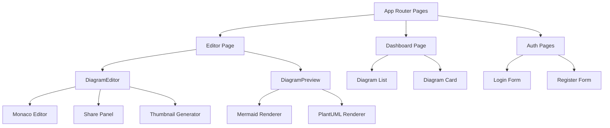
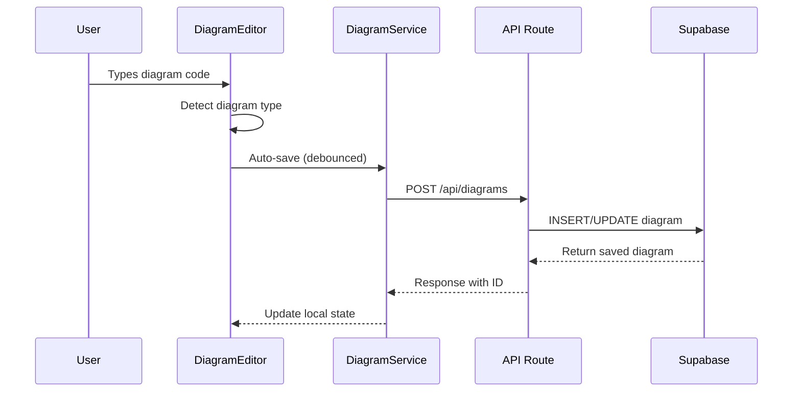

# Component Architecture

## Table of Contents
- [Component Hierarchy](#component-hierarchy)
- [Core Components](#core-components)
- [UI Components](#ui-components)
- [Service Layer](#service-layer)
- [State Management](#state-management)
- [Component Relationships](#component-relationships)

## Component Hierarchy



## Core Components

### DiagramEditor [ref: src/components/DiagramEditor.tsx]

The main diagram editing interface that orchestrates the entire editing experience.

**Key Features**:
- Monaco Editor integration with TypeScript/JavaScript language support
- Real-time diagram type detection (`mermaid` | `plantuml` | `unknown`)
- Auto-save functionality with debounced saves
- Thumbnail generation for diagram previews
- Share panel integration

**Dependencies**:
```typescript
import { Editor } from '@monaco-editor/react'
import { useSession } from 'next-auth/react'
import { diagramService } from '@/services/diagramService'
```

**State Management**:
```typescript
const [content, setContent] = useState<string>('')
const [diagramType, setDiagramType] = useState<DiagramType>('unknown')
const [isSaving, setIsSaving] = useState(false)
```

**Monaco Configuration** [ref: src/components/DiagramEditor.tsx:13-20]:
- Dynamic import to avoid SSR issues
- Custom language registration for diagram syntax
- Theme integration with system preferences

### DiagramPreview [ref: src/components/DiagramPreview.tsx]

Real-time preview component that renders diagrams as users type.

**Rendering Logic**:
- **Mermaid**: Direct browser rendering with mermaid.js
- **PlantUML**: Server-side rendering via API endpoint
- **Error Handling**: Displays syntax errors and rendering issues

**Performance Optimizations**:
- Debounced re-rendering to prevent excessive API calls
- Caching of rendered diagrams
- Progressive loading for large diagrams

### ThumbnailGenerator [ref: src/components/DiagramEditor.tsx:40-60]

Generates preview thumbnails for saved diagrams.

**Implementation**:
```typescript
const generateThumbnail = useCallback(async (content: string) => {
  try {
    const canvas = document.createElement('canvas')
    const ctx = canvas.getContext('2d')
    // Render diagram to canvas and extract thumbnail
    return canvas.toDataURL('image/png')
  } catch (error) {
    console.error('Thumbnail generation failed:', error)
    return null
  }
}, [])
```

### SharePanel [ref: components/SharePanel.tsx]

Manages diagram sharing and visibility settings.

**Features**:
- Public/private toggle
- Share token generation
- URL copying functionality
- Access control settings

**Integration** [ref: types/sharing.ts]:
```typescript
interface SharingSettings {
  isPublic: boolean
  shareToken?: string
  sharedAt?: Date
}
```

## UI Components

Located in `components/ui/` directory, these are reusable UI primitives:

### Button Components
- **Primary Button**: Main action buttons with loading states
- **Secondary Button**: Alternative actions
- **Icon Button**: Compact buttons with icons only

### Form Components
- **Input**: Text input with validation styling
- **Textarea**: Multi-line text input
- **Select**: Dropdown selection component
- **Checkbox**: Boolean input with custom styling

### Layout Components
- **Card**: Content containers with consistent styling
- **Modal**: Overlay dialogs for forms and confirmations
- **Tooltip**: Hover information displays
- **Loading Spinner**: Activity indicators

## Service Layer

### DiagramService [ref: services/diagramService.ts]

Handles all diagram-related API communications.

**Core Methods**:
```typescript
class DiagramService {
  async saveDiagram(diagram: Diagram): Promise<Diagram>
  async loadDiagram(id: string): Promise<Diagram>
  async deleteDiagram(id: string): Promise<void>
  async listUserDiagrams(): Promise<Diagram[]>
  async updateSharing(id: string, settings: SharingSettings): Promise<void>
}
```

**Error Handling** [ref: services/diagramService.ts:35-40]:
- Network error retry logic
- User-friendly error messages
- Offline state management

### ExportService [ref: services/exportService.js]

Provides diagram export functionality in multiple formats.

**Supported Formats**:
- PNG: High-resolution raster export
- SVG: Vector format for scalability
- PDF: Document format for sharing
- JSON: Raw diagram data export

**Implementation Pattern**:
```javascript
export const exportDiagram = async (content, format, options = {}) => {
  const renderer = getRenderer(detectDiagramType(content))
  const output = await renderer.export(content, format, options)
  downloadFile(output, `diagram.${format}`)
}
```

## State Management

### Authentication State [ref: lib/auth.ts]

NextAuth.js manages authentication state globally:

```typescript
// Session context available throughout app
const { data: session, status } = useSession()

// Protected route pattern
if (status === 'loading') return <Loading />
if (!session) return <LoginRequired />
```

### Local Component State

**DiagramEditor State**:
- `content`: Current diagram code
- `diagramType`: Detected diagram format
- `isSaving`: Save operation status
- `shareSettings`: Visibility and sharing configuration

**DiagramPreview State**:
- `renderedContent`: Processed diagram output
- `isLoading`: Rendering status
- `renderError`: Error messages from rendering

### Data Flow Pattern



## Component Relationships

### Editor-Preview Integration

The DiagramEditor and DiagramPreview components maintain tight coupling:

```typescript
// In DiagramEditor.tsx
const [content, setContent] = useState('')
const [diagramType, setDiagramType] = useState<DiagramType>('unknown')

// Pass to preview component
<DiagramPreview
  content={content}
  type={diagramType}
  onRenderComplete={handleRenderComplete}
/>
```

### Service-Component Integration

Components consume services through dependency injection:

```typescript
// DiagramEditor imports and uses diagramService
import { diagramService } from '@/services/diagramService'

const saveDiagram = async () => {
  const saved = await diagramService.saveDiagram({
    title, content, type: diagramType
  })
  setDiagramId(saved.id)
}
```

### Cross-Component Communication

**Event-driven patterns**:
- Save completion triggers thumbnail generation
- Share settings changes update preview URLs
- Authentication state changes affect all protected components

---

## Related Pages
- [System Overview](system-overview.md) - Overall architecture
- [Diagram Editor](diagram-editor.md) - Editor functionality details
- [API Reference](api-reference.md) - Service layer contracts

---

*[← Back to Wiki Index](index.md)*