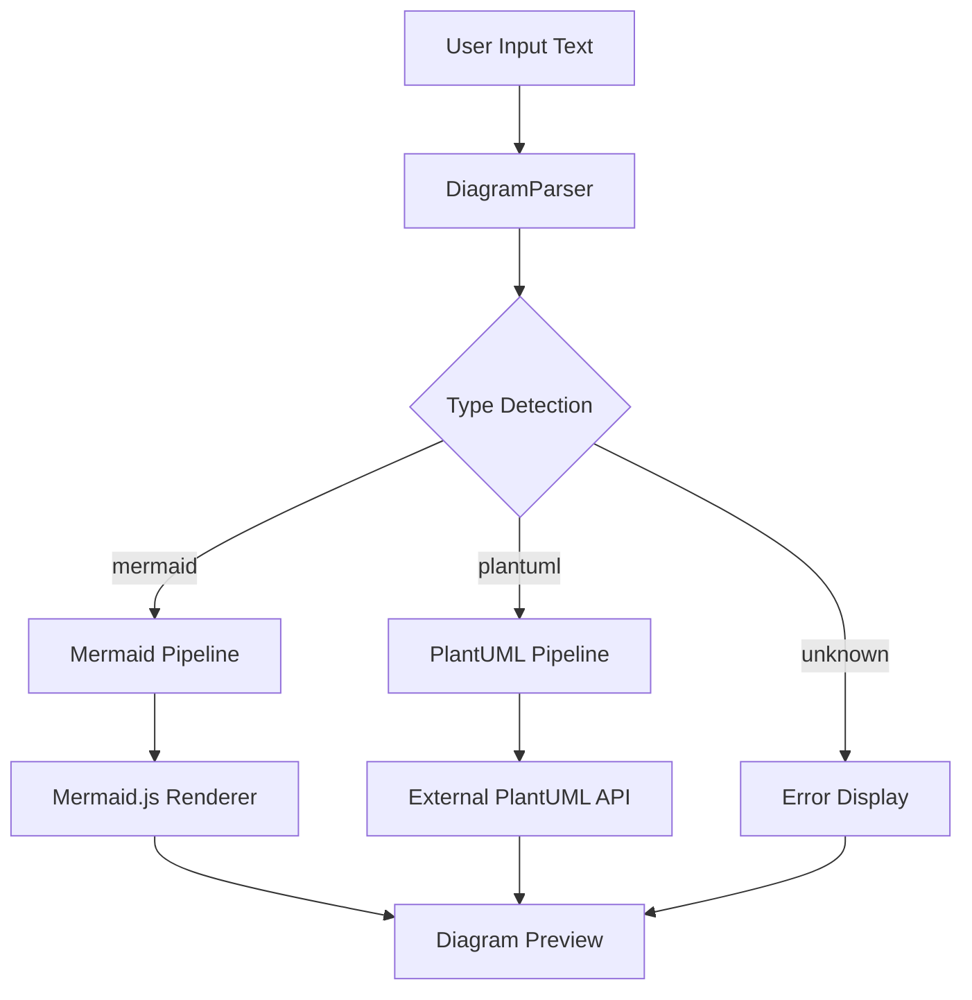

# Diagram Processing

This document details the diagram processing pipeline, including type detection, parsing, and rendering mechanisms for both Mermaid and PlantUML diagrams.

## Table of Contents

1. [Processing Overview](#processing-overview)
2. [Type Detection](#type-detection)
3. [Mermaid Rendering](#mermaid-rendering)
4. [PlantUML Rendering](#plantuml-rendering)
5. [Error Handling](#error-handling)
6. [Performance Optimizations](#performance-optimizations)

## Processing Overview

The diagram processing system automatically detects diagram types and routes them to appropriate renderers, providing a seamless user experience regardless of the diagram format.



## Type Detection

### Detection Algorithm
**Location**: [src/services/diagramParser.ts](../../src/services/diagramParser.ts)

The type detection system uses pattern matching to identify diagram formats:

```typescript
// Simplified type detection logic
export function detectDiagramType(content: string): DiagramType {
  const trimmed = content.trim().toLowerCase();

  // Mermaid detection patterns
  const mermaidPatterns = [
    /^graph\s+(td|tb|bt|rl|lr)/,    // Flowchart
    /^sequencediagram/,              // Sequence diagram
    /^classDiagram/,                 // Class diagram
    /^gantt/,                        // Gantt chart
    /^pie\s+title/,                  // Pie chart
    /^journey/                       // User journey
  ];

  // PlantUML detection patterns
  const plantumlPatterns = [
    /^@startuml/,                    // Standard PlantUML start
    /^@startmindmap/,                // Mind map
    /^@startsalt/,                   // Salt wireframes
    /^@startdot/,                    // Graphviz DOT
    /participant\s+\w+/,             // Sequence participants
    /class\s+\w+\s*\{/              // UML class definition
  ];

  // Check patterns and return type
  if (mermaidPatterns.some(pattern => pattern.test(trimmed))) {
    return 'mermaid';
  }

  if (plantumlPatterns.some(pattern => pattern.test(trimmed))) {
    return 'plantuml';
  }

  return 'unknown';
}
```

### Supported Formats

#### Mermaid Diagrams
- **Flowcharts**: `graph TD`, `graph LR`, `flowchart`
- **Sequence Diagrams**: `sequenceDiagram`
- **Class Diagrams**: `classDiagram`
- **State Diagrams**: `stateDiagram-v2`
- **Entity Relationship**: `erDiagram`
- **Gantt Charts**: `gantt`
- **Pie Charts**: `pie title`
- **User Journey**: `journey`

#### PlantUML Diagrams
- **UML Diagrams**: Class, Sequence, Use Case, Activity
- **Wireframes**: Salt syntax for UI mockups
- **Mind Maps**: `@startmindmap`
- **Network Diagrams**: Custom network topology
- **C4 Models**: Architecture diagrams

## Mermaid Rendering

### Client-Side Rendering
**Location**: [src/components/DiagramPreview.tsx](../../src/components/DiagramPreview.tsx)

Mermaid diagrams are rendered directly in the browser using Mermaid.js:

```typescript
import mermaid from 'mermaid';

export class MermaidRenderer {
  private static initialized = false;

  static async initialize() {
    if (!this.initialized) {
      mermaid.initialize({
        startOnLoad: false,
        theme: 'default',
        securityLevel: 'loose',
        fontFamily: 'monospace'
      });
      this.initialized = true;
    }
  }

  static async render(content: string, element: HTMLElement): Promise<void> {
    await this.initialize();

    try {
      const { svg } = await mermaid.render('diagram', content);
      element.innerHTML = svg;
    } catch (error) {
      throw new Error(`Mermaid rendering failed: ${error.message}`);
    }
  }
}
```

### Configuration
Mermaid is configured with security and performance optimizations:

```typescript
// Mermaid configuration in DiagramPreview component
const mermaidConfig = {
  startOnLoad: false,           // Manual rendering control
  theme: 'default',             // Consistent theme
  securityLevel: 'loose',       // Allow HTML in labels
  fontFamily: 'monospace',      // Code-friendly font
  flowchart: {
    htmlLabels: true,           // Rich text support
    curve: 'basis'              // Smooth connections
  },
  sequence: {
    actorMargin: 50,            // Actor spacing
    bottomMarginAdj: 1          // Bottom margin adjustment
  }
};
```

## PlantUML Rendering

### External Service Integration
**Location**: [app/api/plantuml/render/route.ts](../../app/api/plantuml/render/route.ts)

PlantUML diagrams are rendered using an external service due to Java dependency requirements:

```typescript
export async function POST(request: Request) {
  try {
    const { content } = await request.json();

    // Validate PlantUML content
    if (!content || typeof content !== 'string') {
      return NextResponse.json(
        { error: 'Invalid content' },
        { status: 400 }
      );
    }

    // Encode content for PlantUML service
    const encoded = encodePlantUML(content);
    const serviceUrl = `http://www.plantuml.com/plantuml/svg/${encoded}`;

    // Fetch rendered SVG
    const response = await fetch(serviceUrl);
    if (!response.ok) {
      throw new Error(`PlantUML service error: ${response.status}`);
    }

    const svgContent = await response.text();
    return NextResponse.json({ svg: svgContent });

  } catch (error) {
    return NextResponse.json(
      { error: 'PlantUML rendering failed' },
      { status: 500 }
    );
  }
}
```

### Encoding Algorithm
PlantUML requires special encoding for URL transmission:

```typescript
function encodePlantUML(plantuml: string): string {
  // Add UML wrapper if not present
  const wrapped = plantuml.startsWith('@startuml')
    ? plantuml
    : `@startuml\n${plantuml}\n@enduml`;

  // Compress and encode for URL
  const compressed = deflate(wrapped);
  return encode64(compressed);
}
```

### Service Endpoint
- **External Service**: `http://www.plantuml.com/plantuml/svg/`
- **Format**: SVG output for scalable rendering
- **Timeout**: 10 second request timeout
- **Caching**: Browser-level caching for identical diagrams

## Error Handling

### Rendering Error Types
**Location**: [src/components/ErrorDisplay.tsx](../../src/components/ErrorDisplay.tsx)

The system handles various error scenarios gracefully:

```typescript
interface RenderError {
  type: 'syntax' | 'network' | 'timeout' | 'unknown';
  message: string;
  line?: number;
  column?: number;
}

export function handleRenderError(error: Error, diagramType: DiagramType): RenderError {
  // Mermaid syntax errors
  if (diagramType === 'mermaid' && error.message.includes('Parse error')) {
    return {
      type: 'syntax',
      message: 'Mermaid syntax error: Check diagram structure',
      line: extractLineNumber(error.message)
    };
  }

  // PlantUML service errors
  if (diagramType === 'plantuml' && error.message.includes('fetch')) {
    return {
      type: 'network',
      message: 'PlantUML service unavailable'
    };
  }

  // Generic errors
  return {
    type: 'unknown',
    message: `Rendering failed: ${error.message}`
  };
}
```

### Error Display
Errors are displayed inline with helpful messages:

```tsx
function ErrorDisplay({ error }: { error: RenderError }) {
  const errorStyles = {
    syntax: 'border-red-500 bg-red-50',
    network: 'border-yellow-500 bg-yellow-50',
    timeout: 'border-orange-500 bg-orange-50',
    unknown: 'border-gray-500 bg-gray-50'
  };

  return (
    <div className={`border-2 rounded p-4 ${errorStyles[error.type]}`}>
      <h4 className="font-bold text-red-700">Rendering Error</h4>
      <p className="text-sm">{error.message}</p>
      {error.line && (
        <p className="text-xs text-gray-600">Line {error.line}</p>
      )}
    </div>
  );
}
```

## Performance Optimizations

### Debounced Rendering
**Location**: [src/components/DiagramPreview.tsx](../../src/components/DiagramPreview.tsx)

Live preview updates are debounced to prevent excessive rendering:

```typescript
export function DiagramPreview({ content }: { content: string }) {
  const [renderedContent, setRenderedContent] = useState('');

  // Debounce content updates
  useEffect(() => {
    const timer = setTimeout(() => {
      setRenderedContent(content);
    }, 300); // 300ms debounce

    return () => clearTimeout(timer);
  }, [content]);

  // Render when debounced content changes
  useEffect(() => {
    if (renderedContent) {
      renderDiagram(renderedContent);
    }
  }, [renderedContent]);
}
```

### Mermaid Initialization
Mermaid is initialized once and reused for all renders:

```typescript
// Singleton pattern for Mermaid initialization
class MermaidSingleton {
  private static instance: MermaidSingleton;
  private initialized = false;

  static getInstance(): MermaidSingleton {
    if (!MermaidSingleton.instance) {
      MermaidSingleton.instance = new MermaidSingleton();
    }
    return MermaidSingleton.instance;
  }

  async ensureInitialized(): Promise<void> {
    if (!this.initialized) {
      await mermaid.initialize(MERMAID_CONFIG);
      this.initialized = true;
    }
  }
}
```

### PlantUML Caching
PlantUML requests are cached to avoid redundant API calls:

```typescript
// Simple in-memory cache for PlantUML renders
const plantUMLCache = new Map<string, string>();

async function renderPlantUML(content: string): Promise<string> {
  const cacheKey = hashContent(content);

  // Check cache first
  if (plantUMLCache.has(cacheKey)) {
    return plantUMLCache.get(cacheKey)!;
  }

  // Render and cache result
  const svg = await fetchPlantUMLRender(content);
  plantUMLCache.set(cacheKey, svg);

  return svg;
}
```

### Webpack Optimization
**Location**: [next.config.js](../../next.config.js)

Heavy dependencies are externalized to reduce bundle size:

```javascript
module.exports = {
  webpack: (config) => {
    // Externalize heavy graphics libraries
    config.externals = {
      canvas: 'commonjs canvas',
      'utf-8-validate': 'commonjs utf-8-validate',
      bufferutil: 'commonjs bufferutil'
    };

    return config;
  }
};
```

## Integration Points

### With DiagramEditor
The editor provides real-time content to the preview system:

```typescript
// DiagramEditor sends updates to preview
function DiagramEditor() {
  const [content, setContent] = useState('');

  return (
    <div className="flex">
      <MonacoEditor
        value={content}
        onChange={setContent}
      />
      <DiagramPreview content={content} />
    </div>
  );
}
```

### With Save System
Processed diagrams are validated before saving:

```typescript
// Validation before save
async function saveDiagram(content: string): Promise<void> {
  const type = detectDiagramType(content);

  if (type === 'unknown') {
    throw new Error('Unable to detect diagram type');
  }

  // Test render before saving
  await testRender(content, type);

  // Save to database
  await diagramService.save({ content, type });
}
```

---

## Related Pages
- [Architecture Overview](architecture/overview.md) - System architecture
- [Frontend Components](frontend-components.md) - Component implementation
- [API Reference](api-reference.md) - PlantUML API endpoint
- [Business Services](business-services.md) - Service layer details

*All file references are relative to repository root: `/workspace/main-repo/`*