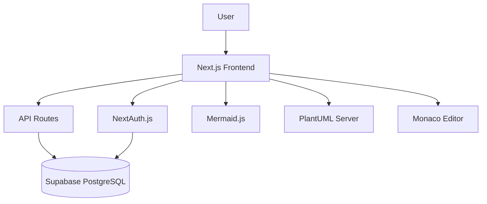

# DD Preview Parser Wiki

Welcome to the comprehensive documentation for the DD Preview Parser - a Next.js application for creating, editing, and previewing diagrams in multiple formats.

## 📋 Table of Contents

### Architecture Documentation
- [[architecture/overview]] - System architecture and technology stack
- [[architecture/authentication-system]] - NextAuth.js + Supabase authentication
- [[architecture/diagram-editor]] - Core editor components and data flow
- [[architecture/api-reference]] - REST API endpoints and schemas
- [[architecture/rendering-engine]] - Mermaid.js and PlantUML integration
- [[architecture/database-schema]] - Supabase PostgreSQL schema
- [[architecture/deployment]] - Setup, migration, and deployment guide

### Component Documentation
- [[components]] - React components and UI architecture
- [[services]] - Services, utilities, and business logic
- [[testing]] - Testing strategy and test organization

## 🏗️ System Overview

DD Preview Parser is a modern web application built with Next.js 14 that enables users to create, edit, and preview diagrams using Mermaid and PlantUML syntax. The application features real-time preview, user authentication, and diagram persistence.

**Technology Stack:**
- **Frontend**: Next.js 14 with App Router, React 18, TypeScript [ref: package.json:26,30,50]
- **Editor**: Monaco Editor with syntax highlighting [ref: package.json:14,25]
- **Rendering**: Mermaid.js for diagram visualization [ref: package.json:24]
- **Authentication**: NextAuth.js with Supabase backend [ref: package.json:27,15]
- **Database**: Supabase PostgreSQL with Row Level Security
- **Styling**: TailwindCSS with Lucide React icons [ref: package.json:35,23]

## 🚀 Quick Start

```bash
# Install dependencies
npm install

# Start development server
npm run dev

# Run tests
npm test

# Build for production
npm run build
```

## 📁 Repository Structure

```
/workspace/main-repo/
├── app/                 # Next.js App Router pages and API routes
│   ├── api/            # REST API endpoints
│   ├── auth/           # Authentication pages
│   ├── dashboard/      # User dashboard
│   └── editor/         # Diagram editor interface
├── src/                # Core application logic
│   ├── components/     # React components
│   └── services/       # Business logic services
├── components/         # Additional React components
├── lib/               # Configuration and utilities
├── services/          # Client-side API services
└── __tests__/         # Test suites
```

## 🔍 Key Features

- **Real-time Diagram Preview**: Live rendering as you type [ref: src/components/DiagramEditor.tsx]
- **Multi-format Support**: Mermaid and PlantUML diagram types [ref: src/services/DiagramRenderer.ts]
- **User Authentication**: Secure login/registration with session management [ref: lib/auth.ts]
- **Diagram Persistence**: Save, load, and organize diagrams [ref: services/diagramService.ts]
- **Export Options**: Multiple export formats for sharing [ref: components/ExportPanel.js]
- **Responsive Design**: Works on desktop and mobile devices

## 📊 System Architecture



## 🔗 Navigation

Use the links above to explore specific aspects of the system architecture and implementation details. Each section contains detailed information with concrete file references and code examples from the actual codebase.

---

*Last updated: Based on repository analysis as of current state*