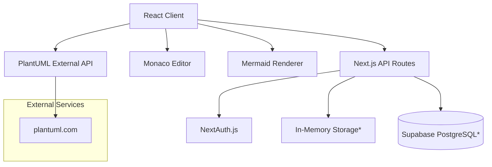

# System Overview

## Table of Contents
- [Business Functionality](#business-functionality)
- [Architecture Overview](#architecture-overview)
- [Technology Stack](#technology-stack)
- [Directory Structure](#directory-structure)
- [Data Storage & External Integrations](#data-storage--external-integrations)
- [Security Architecture](#security-architecture)
- [Performance Considerations](#performance-considerations)

## Business Functionality

**DD Preview Parser** is a modern web-based diagram editor that provides:

### Core Business Capabilities
1. **Diagram Creation & Editing**: Real-time Monaco editor with syntax highlighting [ref: app/page.tsx:7-14]
2. **Multi-format Support**: Mermaid, PlantUML, flowcharts, sequence diagrams, class diagrams [ref: package.json:24,28]
3. **User Management**: Registration, authentication, and personal diagram collections [ref: app/api/auth/]
4. **Export Functionality**: SVG, PNG, PDF export capabilities [ref: services/exportService.js:4-8]
5. **Sharing System**: Public/private diagram visibility and sharing [ref: components/SharePanel.tsx]

### User Workflows
1. **Anonymous Users**: Can create and edit diagrams on landing page [ref: app/page.tsx:32-37]
2. **Registered Users**: Access personal dashboard, save diagrams, manage collections [ref: app/dashboard/]
3. **Export Users**: Download diagrams in multiple formats with client-side rendering [ref: services/exportService.js:11-26]

## Architecture Overview

**Current Implementation**: The system uses a hybrid architecture with in-memory storage for development and Supabase schema for production:



**Note**: *Storage implementation is currently missing `@/lib/storage` but referenced throughout API routes*

### Core System Components

1. **Frontend Layer**: React components with TypeScript [ref: src/components/, components/]
2. **API Layer**: Next.js App Router API routes [ref: app/api/]
3. **Authentication**: NextAuth.js with credentials provider [ref: lib/auth.ts]
4. **Storage Layer**: Hybrid approach - in-memory (dev) + Supabase schema (prod) [ref: supabase-schema.sql]
5. **Editor Integration**: Monaco Editor with dynamic loading [ref: app/page.tsx:6-14]

## Technology Stack

### Frontend Technologies
- **Next.js 14.0.0**: React framework with App Router [ref: package.json:26]
- **React 18.2.0**: UI library with dynamic imports [ref: package.json:30]
- **TypeScript 5.0.0**: Full type safety throughout application [ref: package.json:50]
- **Tailwind CSS 3.3.0**: Utility-first styling framework [ref: package.json:35]
- **Tailwind Merge**: Dynamic class merging [ref: package.json:34]

### Editor & Rendering Stack
- **Monaco Editor 0.44.0**: Microsoft's VS Code editor [ref: package.json:26]
- **@monaco-editor/react 4.6.0**: React integration wrapper [ref: package.json:14]
- **Mermaid 11.11.0**: JavaScript diagramming library [ref: package.json:24]
- **React Syntax Highlighter**: Code syntax highlighting [ref: package.json:32]
- **PlantUML Encoder**: UML diagram encoding [ref: package.json:28]

### Authentication & Security
- **NextAuth.js 4.24.0**: Authentication framework [ref: package.json:27]
- **bcryptjs 2.4.3**: Password hashing [ref: package.json:19]
- **jsonwebtoken 9.0.2**: JWT token handling [ref: package.json:22]

### External Integrations
- **Supabase 2.57.4**: PostgreSQL database and auth [ref: package.json:15]
- **Axios 1.6.0**: HTTP client for API calls [ref: package.json:18]
- **PlantUML.com**: External rendering service [ref: app/api/plantuml/render/route.ts:14]

### UI/UX Libraries
- **Lucide React**: Icon system [ref: package.json:23]
- **Sonner**: Toast notifications [ref: package.json:33]
- **Date-fns**: Date manipulation [ref: package.json:21]
- **CLSX**: Conditional class names [ref: package.json:20]

## Directory Structure

```
/workspace/main-repo/
├── app/                    # Next.js App Router (23 files)
│   ├── api/               # REST API endpoints
│   │   ├── auth/          # Authentication endpoints
│   │   │   ├── [...nextauth]/route.ts  # NextAuth handler
│   │   │   └── register/route.ts       # User registration
│   │   ├── diagrams/      # Diagram CRUD operations
│   │   │   ├── [id]/route.ts          # Individual diagram ops
│   │   │   └── route.ts                # List/create diagrams
│   │   ├── plantuml/      # PlantUML rendering service
│   │   │   ├── render/route.ts         # PlantUML rendering
│   │   │   ├── validate/route.ts       # PlantUML validation
│   │   │   └── status/route.ts         # Service status
│   │   └── test-data/route.ts         # Development test data
│   ├── auth/              # Authentication pages
│   ├── dashboard/         # User dashboard interface
│   ├── editor/            # Diagram editor interface
│   │   └── [id]/page.tsx  # Individual diagram editor
│   ├── page.tsx           # Landing page with inline editor
│   ├── layout.tsx         # Root layout component
│   └── providers.tsx      # Context providers
├── src/                   # Core application code (52 files)
│   └── components/        # React components (referenced but structure unknown)
├── components/            # Reusable UI components (14 files)
│   ├── AuthForm.tsx       # Login/register form
│   ├── ExportPanel.js     # Export functionality UI
│   ├── SharePanel.tsx     # Diagram sharing interface
│   ├── SharedDiagramView.tsx  # Public diagram viewer
│   └── ui/               # Shadcn/ui component library
├── services/             # Business logic services (2 files)
│   ├── diagramService.ts # Diagram CRUD operations
│   └── exportService.js  # Client-side export handling
├── lib/                  # Utilities and configurations (3 files)
│   ├── auth.ts           # NextAuth configuration
│   ├── errorHandler.js   # Error handling utilities
│   └── validation.js     # Input validation
├── hooks/                # Custom React hooks (2 files)
│   └── useDiagrams.ts    # Diagram state management
├── types/                # TypeScript definitions (2 files)
├── tests/                # Test suites (6 files)
├── __tests__/            # Additional tests (2 files)
└── js/                   # Legacy JavaScript (10 files)
```

## Data Storage & External Integrations

### Current Storage Architecture
**Critical Issue**: The system references `@/lib/storage` throughout API routes but this module is missing from the codebase [ref: app/api/diagrams/route.ts:4, app/api/auth/register/route.ts:3]

#### Development Storage (Missing Implementation)
- In-memory user and diagram storage
- Methods: `createUser()`, `findUserByEmail()`, `createDiagram()`, `findDiagramsByOwner()`
- Arrays: `storage.users`, `storage.diagrams` [ref: app/api/test-data/route.ts:48-49]

#### Production Database Schema [ref: supabase-schema.sql]
```sql
-- Users table with UUID primary keys
CREATE TABLE users (
  id UUID DEFAULT gen_random_uuid() PRIMARY KEY,
  email TEXT UNIQUE NOT NULL,
  name TEXT NOT NULL,
  created_at TIMESTAMP WITH TIME ZONE DEFAULT NOW()
);

-- Diagrams with ownership and visibility controls
CREATE TABLE diagrams (
  id UUID DEFAULT gen_random_uuid() PRIMARY KEY,
  title TEXT NOT NULL,
  content TEXT NOT NULL,
  type TEXT DEFAULT 'mermaid',
  is_public BOOLEAN DEFAULT FALSE,
  owner_id UUID REFERENCES users(id)
);
```

### External Service Integrations

#### PlantUML Service [ref: app/api/plantuml/]
- **External API**: `http://www.plantuml.com/plantuml` [ref: app/api/plantuml/render/route.ts:14]
- **Encoding**: plantuml-encoder for URL generation [ref: app/api/plantuml/render/route.ts:13]
- **Formats**: SVG, PNG support via external rendering
- **API Endpoints**: `/api/plantuml/render`, `/api/plantuml/validate`, `/api/plantuml/status`

#### Supabase Integration
- **Client Library**: @supabase/supabase-js v2.57.4 [ref: package.json:15]
- **Authentication**: Supabase Auth (schema prepared but using NextAuth in code)
- **Database**: PostgreSQL with Row Level Security policies [ref: supabase-schema.sql:35-59]

## Security Architecture

### Authentication Flow [ref: lib/auth.ts]
```typescript
// NextAuth.js with credentials provider
export const authOptions: NextAuthOptions = {
  session: { strategy: 'jwt', maxAge: 30 * 24 * 60 * 60 },
  providers: [CredentialsProvider({
    async authorize(credentials) {
      const user = storage.findUserByEmail(credentials.email);
      const isValid = await bcrypt.compare(credentials.password, user.password);
      return isValid ? { id: user.id, email: user.email, name: user.name } : null;
    }
  })]
};
```

### API Route Protection
- **Session Validation**: `getServerSession(authOptions)` [ref: app/api/diagrams/route.ts:8]
- **Authorization Checks**: User ownership validation [ref: app/api/diagrams/route.ts:17-23]
- **Password Hashing**: bcryptjs with salt rounds of 12 [ref: app/api/auth/register/route.ts:33]

### Database Security [ref: supabase-schema.sql:35-59]
- **Row Level Security**: Enabled on users and diagrams tables
- **Ownership Policies**: Users can only access their own data
- **Public Access**: Separate policies for public diagram viewing
- **JWT Integration**: auth.uid() for user identification

## Performance Considerations

### Frontend Optimization
- **Dynamic Loading**: Monaco Editor loaded client-side only [ref: app/page.tsx:7-8]
- **Code Splitting**: Dynamic imports prevent SSR issues
- **Responsive Design**: Mobile-first approach with progressive enhancement [ref: app/page.tsx:52-103]

### Client-Side Export Performance [ref: services/exportService.js]
- **SVG Direct Export**: No server round-trip for SVG format [ref: services/exportService.js:11-13]
- **PNG Canvas Conversion**: Client-side rendering using HTML5 Canvas [ref: services/exportService.js:48-74]
- **Blob Download**: Direct browser download without server storage [ref: services/exportService.js:99-108]

### Potential Performance Issues
- **Missing Storage Module**: API routes will fail without storage implementation
- **External PlantUML Dependency**: Network latency for PlantUML rendering
- **In-Memory Storage**: No persistence in development mode
- **Large Diagrams**: Canvas conversion may be memory intensive

## Key Data Contracts

### Diagram Interface [ref: hooks/useDiagrams.ts:4-16]
```typescript
interface Diagram {
  id: string;
  title: string;
  description: string;
  content: string;
  type: string;                    // 'mermaid', 'plantuml', 'flowchart', etc.
  isPublic: boolean;              // Visibility control
  ownerId: string;                // User ownership
  thumbnail?: string;             // Optional preview image
  participantCount?: number;      // For collaboration features
  createdAt: string;
  updatedAt: string;
}
```

### Authentication Interfaces [ref: components/AuthForm.tsx:7-16]
```typescript
interface AuthFormProps {
  mode: 'login' | 'register';
}

interface FormData {
  email: string;
  password: string;
  name: string;          // Required for registration only
}
```

### Export Service Contract [ref: services/exportService.js:4-8]
```javascript
const EXPORT_FORMATS = [
  { value: 'svg', label: 'SVG', description: 'Vector format, scalable' },
  { value: 'png', label: 'PNG', description: 'Raster image, web-friendly' },
  { value: 'pdf', label: 'PDF', description: 'Document format, printable' }
];
```

## Critical Implementation Gaps

### Missing Components
1. **Storage Module**: `@/lib/storage` referenced but not implemented [ref: app/api/diagrams/route.ts:4]
2. **Database Connection**: Supabase client integration missing despite schema existence
3. **Diagram Service**: Hook references `../lib/diagramService` but file doesn't exist [ref: hooks/useDiagrams.ts:2]

### Architectural Inconsistencies
1. **Dual Storage Approach**: Code suggests both in-memory (dev) and Supabase (prod) but implementation incomplete
2. **Mixed File Organization**: Components split between `/src/components/` and `/components/`
3. **Authentication Mismatch**: Using NextAuth.js while Supabase Auth schema is prepared

## Development Recommendations

### Immediate Fixes Required
1. **Implement Missing Storage Module**: Create `@/lib/storage.ts` with required methods
2. **Complete Supabase Integration**: Connect database layer with existing schema
3. **Resolve Component Structure**: Consolidate component organization
4. **Add Error Boundaries**: Implement proper error handling for missing services

### Architecture Improvements
1. **Consistent Data Layer**: Choose between Supabase or in-memory storage
2. **Service Layer**: Complete diagram service implementation
3. **Type Safety**: Extend TypeScript coverage to all JavaScript files
4. **Testing**: Expand test coverage for critical paths

---

## Technical Summary

**DD Preview Parser** is a sophisticated diagram editor with solid architectural foundations but incomplete implementation. The system demonstrates modern React/Next.js patterns with TypeScript integration, comprehensive authentication flows, and external service integration. However, critical storage layer components are missing, creating a gap between the well-designed API interfaces and actual data persistence.

**Key Strengths:**
- Modern tech stack with Next.js 14 and React 18
- Comprehensive authentication system with NextAuth.js
- Multi-format diagram support (Mermaid, PlantUML)
- Client-side export capabilities
- Responsive, mobile-first design

**Critical Issues:**
- Missing storage implementation breaks API functionality
- Incomplete Supabase integration despite prepared schema
- Mixed architectural patterns need consolidation

---

## Related Documentation
- [Component Architecture](component-architecture.md) - React component structure and relationships
- [Diagram Editor Details](diagram-editor.md) - Editor implementation and rendering pipeline
- [README](README.md) - Wiki navigation and overview

---

*[← Back to Wiki Index](index.md)*