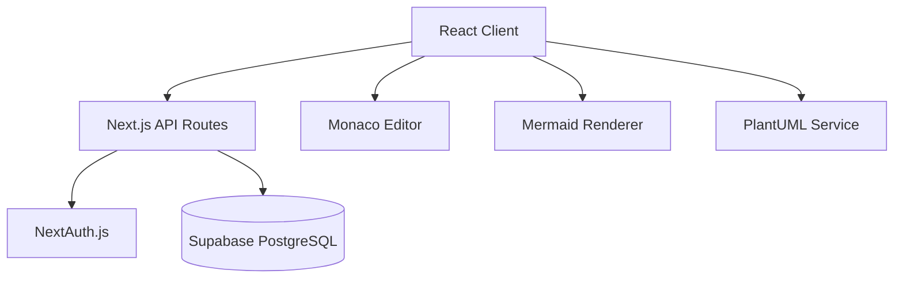

# System Overview

## Table of Contents
- [Architecture Overview](#architecture-overview)
- [Technology Stack](#technology-stack)
- [Directory Structure](#directory-structure)
- [Build Configuration](#build-configuration)
- [Deployment Model](#deployment-model)

## Architecture Overview

DD Preview Parser follows a modern full-stack architecture with clear separation of concerns:



### Core System Components

1. **Frontend Layer**: React components with TypeScript [ref: src/components/]
2. **API Layer**: Next.js App Router API routes [ref: app/api/]
3. **Authentication**: NextAuth.js with credential provider [ref: lib/auth.ts]
4. **Database**: Supabase PostgreSQL with RLS [ref: supabase-schema.sql]
5. **Editor**: Monaco Editor integration [ref: src/components/DiagramEditor.tsx:13]

## Technology Stack

### Frontend Technologies
- **Next.js 14.2.15**: React framework with App Router [ref: package.json:17]
- **React 18**: UI library [ref: package.json:18]
- **TypeScript**: Type safety and development experience [ref: package.json:35]
- **Tailwind CSS**: Utility-first styling [ref: package.json:31]

### Editor & Rendering
- **Monaco Editor**: Microsoft's code editor [ref: package.json:25]
- **Mermaid 11.4.0**: Diagram rendering library [ref: package.json:24]
- **PlantUML**: Alternative diagram syntax via API [ref: app/api/plantuml/]

### Backend & Database
- **Supabase**: PostgreSQL database with authentication [ref: package.json:29]
- **NextAuth.js**: Authentication framework [ref: package.json:26]
- **Row Level Security**: Database-level access control [ref: supabase-schema.sql:29-41]

### Development Tools
- **ESLint**: Code linting [ref: package.json:22]
- **PostCSS**: CSS processing [ref: package.json:27]
- **Autoprefixer**: CSS vendor prefixes [ref: package.json:19]

## Directory Structure

```
/workspace/main-repo/
├── app/                    # Next.js App Router (23 files)
│   ├── api/               # REST API endpoints
│   │   ├── auth/          # Authentication routes
│   │   ├── diagrams/      # Diagram CRUD operations
│   │   └── plantuml/      # PlantUML rendering service
│   ├── auth/              # Authentication pages
│   │   ├── login/         # Login page
│   │   └── register/      # Registration page
│   ├── dashboard/         # User dashboard
│   ├── editor/            # Main diagram editor interface
│   └── page.tsx           # Landing page
├── src/                   # Core application code (52 files)
│   └── components/        # React components
│       ├── DiagramEditor.tsx    # Main editor component
│       └── DiagramPreview.tsx   # Real-time preview
├── components/            # Reusable UI components (14 files)
│   └── ui/               # Shadcn/ui components
├── services/             # Business logic (2 files)
│   ├── diagramService.ts # Diagram API client
│   └── exportService.js  # Export functionality
├── lib/                  # Utilities and configurations (3 files)
│   └── auth.ts           # NextAuth configuration
├── types/                # TypeScript definitions (2 files)
│   └── sharing.ts        # Sharing-related types
├── hooks/                # Custom React hooks (2 files)
├── __tests__/            # Test files (2 files)
├── js/                   # Legacy JavaScript files (10 files)
└── tests/                # Additional test files (6 files)
```

## Build Configuration

### Next.js Configuration [ref: next.config.js]
```javascript
/** @type {import('next').NextConfig} */
const nextConfig = {
  experimental: {
    esmExternals: 'loose'
  },
  webpack: (config) => {
    config.externals.push({
      canvas: 'canvas'
    })
    return config
  }
}
```

**Key configurations**:
- **ESM Externals**: Loose mode for better module compatibility [ref: next.config.js:3]
- **Canvas Externalization**: Prevents canvas bundling issues [ref: next.config.js:11-13]
- **Mermaid Transpilation**: Special webpack handling [ref: next.config.js:25]

### Package Scripts [ref: package.json]
- `npm run dev`: Development server on port 3000
- `npm run build`: Production build
- `npm run start`: Start production server
- `npm run lint`: ESLint code checking

## Deployment Model

### Environment Requirements
- **Node.js**: Version compatible with Next.js 14
- **Database**: Supabase PostgreSQL instance
- **Environment Variables**: Authentication and database credentials

### Database Schema [ref: supabase-schema.sql]
- **Users table**: User accounts with email/password auth [ref: supabase-schema.sql:8-14]
- **Diagrams table**: Diagram storage with ownership and visibility [ref: supabase-schema.sql:17-27]
- **RLS Policies**: Row-level security for data access [ref: supabase-schema.sql:29-41]

### Security Considerations
- **Authentication**: NextAuth.js session management [ref: lib/auth.ts:1-45]
- **API Protection**: Route protection with session validation [ref: app/api/diagrams/route.ts:15-18]
- **Database Security**: Supabase RLS policies [ref: supabase-schema.sql:29-41]

---

## Related Pages
- [Component Architecture](component-architecture.md) - React component structure
- [API Reference](api-reference.md) - REST API documentation
- [Development Setup](development-setup.md) - Local development guide

---

*[← Back to Wiki Index](index.md)*